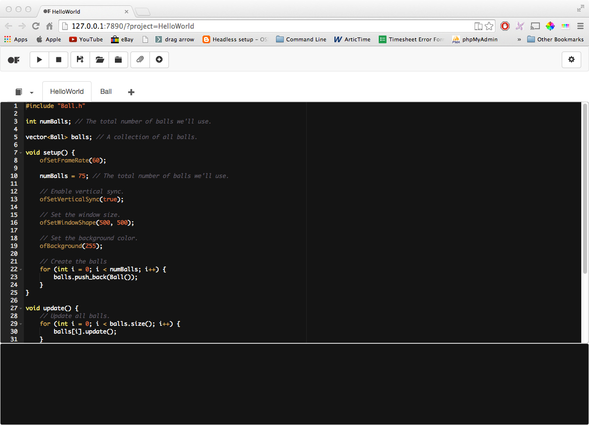
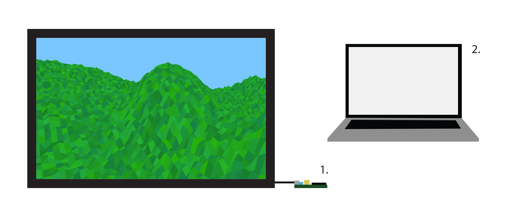

# ofSketch
By Brannon Dorsey (& Christopher Baker?)

# What is ofSketch?
[ofSketch](https://github.com/olab-io/ofSketch) is a barebones development environment created specifically for building and running openFrameworks sketches. It is a "plug and play" openFrameworks application that allows you to spend more time coding and less time with configuration.

One of its main goals in developing ofSketch is to decrease the openFrameworks barrier-to-entry. For this reason, it should be noted that ofSketch is primary geared towards beginners and new coders. 

## What is ofSketch Good For?

- Teaching/Learning openFrameworks
- Making [the leap](http://openframeworks.cc/tutorials/first%20steps/002_openFrameworks_for_processing_users.html) from [Processing](http://processing.org) to openFrameworks
- Writing and running code quickly
- Creating code snippets, experiments, and examples
- Running openFrameworks on the [Raspberry Pi](http://www.raspberrypi.org/)

## What is ofSketch NOT Good For?

- Replacing a professional IDE like Xcode, Code::Blocks, Visual Studio, etc...
- Building sizable projects or applications

If you've read Roy's _openFrameworks Project Structure and Setup_ chapter, ofSketch should be an easy step sideways. That chapter gave an overview of installing and using openFrameworks with different professional IDEs. If you skipped ahead to this chapter, that is okay too! With ofSketch you don't have to worry about downloading openFrameworks or using Project Generator. All you need to do is download the ofSketch App.

# Download & Install

Visit the ofSketch [releases page](https://github.com/olab-io/ofSketch/releases) to download the ofSketch app for your platform.

ofSketch comes packaged with the following files:

- [CHANGELOG.md](https://github.com/olab-io/ofSketch/blob/master/CHANGELOG.md)
- [CONTRIBUTING.md](https://github.com/olab-io/ofSketch/blob/master/CONTRIBUTING.md)
- data/
- [LICENSE.md](https://github.com/olab-io/ofSketch/blob/master/LICENSE.md)
- ofSketch app
- [README.md](https://github.com/olab-io/ofSketch/blob/master/README.md)

It is important for the ofSketch app and the "data" folder to stay in the same directory. I recommend that you leave the app in the uncompressed folder that you download.

Double-click ofSketch to launch the editor. If you are on a Mac, you may need to right click the app, and then press "Open".

That's it! Go code.

# Getting Started With ofSketch

Code in ofSketch looks a bit different than what you may be used to with openFrameworks. If you are new to openFrameworks, great! We think that ofSketch code is easier to learn than normal`.h` and `.cpp` openFrameworks code. 

## ofSketch Style Code

ofSketch uses "header style" C++, where code implementation is written along with declarations in the header file, instead of the matching `.cpp` source file. If this doesn't make since to you, no worries. Essentially, this allows us to write simple, easy-to-read code, that is great for beginners!

### Project File

Every ofSketch project starts with an empty project file that looks like this:

	void setup() {
	        // put your setup code here, to run once:
	        
	}
	
	void draw() {
	        // put your main code here, to run once each frame:
	        
	}

If you are coming from Processing, this should be extremely familiar. To add global functions and variables, simply add them to this project file. You don't need to prefix any identifiers (variables, functions, etc...) with `ofApp` or the older`testApp`. 

	// global variables go up here
	std::string text; 
	
	void setup() {
	        // put your setup code here, to run once:
	        text = "Hello World!";
	        printHelloWorld(); // function call
	}
	
	void draw() {
	        // put your main code here, to run once each frame:
	        
	}
	
	// global functions go down here
	void printHelloWorld() {
	    cout << text << endl;
	}

### Classes

Using classes in ofSketch is easy! Press the "+" button in the tab bar to add a new class. When you do this a class template is automatically generated for you. Here is an example class template for a class called "MyNewClass":

	class MyNewClass{

	public:

        MyNewClass(){

        }        
	};

This is essentially a regular `.h` file. The default constructor is explicitly defined in the generated template, but adding class members is easy. Just remember to both declare and implement all of the functions that you write in this file. Here is an example of a basic "Particle" class that could be used in a simple particle system.

	class Particle{

	public:

	    ofVec2f location;
	    ofVec2f velocity;
	    ofVec2f acceleration;
	    
	    ofColor color;
	    
	    float maxSpeed;
	    
	    int radius;
	    
	    // default constructor
	    Vehicle() {}; 
	    // overloaded constructor
	    Vehicle(float x, float y) {
	        
	        acceleration = ofVec2f(0,0);
	        velocity = ofVec2f(0, -2);
	        location = ofVec2f(x,y);
	        color = ofColor(ofRandom(255), 0, 255);
	        radius = 6.0;
	        
	        maxSpeed = 4;
	    }
	    
	    void update() {
	        
	        velocity += acceleration;
	        velocity.limit(maxSpeed);
	        location += velocity;
	        acceleration *= 0;
	    }
	    
	    void draw() {
	        
	        ofFill();
	        ofSetColor(color);
	        ofCircle(location.x, location.y, radius); 
	    }
	
	// etc...
	
	};

### Includes

Every ofSketch file includes "ofMain.h" by default. To include custom classes, simply put `#include "ClassName.h"` at the top of any file that needs to use that class. Below is an example of how to include the Particle class file above in the project file.

	#include "Particle.h"
	
	Particle p;
	
	void setup() {
	        // put your setup code here, to run once:
	     // create a particle at the center 
	     p = Particle(ofGetWidth()/2, ofGetHeight()/2);    
	}
	
	void update() {
	    p.update();
	
	}
	
	void draw() {
	        // put your main code here, to run once each frame:
	    p.draw(); 
	}

Here we include the "Particle.h" file, use it to instantiate a Particle object "p", and then place it in the middle of the screen.

Note that we also added an `update` function. As you may know by now, it is customary in openFrameworks to separate operations that update logic from operations that render graphics to the screen. This is for performance reasons, however, it is not necessary, and all of the code placed in `void update()` can instead live inside of `void draw()` if you prefer.

### Examples

ofSketch comes packaged with a few basic examples that illustrate the ofSketch code style. Most of them are ported from the regular openFrameworks examples, but there are a few new ones too. Press the "Open Project" button inside ofSketch to open one of them. 

While the above examples highlight the difference between ofSketch code and a normal  implementation of C++ code, reviewing the examples should give you a better idea of the general ofSketch style.

# Sketch Format

If you take a look at an app in your Projects folder, you will see a "sketch" directory. This is where all of the ofSketch source files are saved, each with a ".sketch" file extension. When you use ofSketch you are editing the files in this directory. Whenever you run an app from inside ofSketch, all of the files in the "sketch" directory are processed to generate the source files inside of the "src" directory. 

Because of this workflow, it is important to edit ofSketch projects through __ofSketch only__. You could easily get yourself into trouble if you edited an ofSketch project with Xcode (modifying the files in the "src" directory) and then opened it in ofSketch again, pressed the play button, and then overwrote all of our changes.

Soon, ofSketch will include a fancy project export feature which will allow you to export/import a project to a professional IDE target of your choice. Until then, it is best to just copy a project if you want to edit it with something other than ofSketch.

# Remote Coding

One of the highlights of the ofSketch browser editor is the ability to edit code on a remote machine through a network connection. This is especially helpful when coding with the Raspberry Pi, or when tweaking live installation code. The figure below illustrates this in practice. 

1. Raspberry Pi running ofSketch app connected to a TV
2. Laptop with web browser pointed to RPi's IP address and port 7890 (e.x. http://192.168.0.204:7890)

To code with ofSketch remotely, start ofSketch on the machine that you want to display the openFrameworks app on. In order to connect to ofSketch from that machine, you need to know its unique IP address on the network. You can use an application like [Bonjour Browser](https://www.google.com/webhp?sourceid=chrome-instant&ion=1&espv=2&ie=UTF-8#q=bonjour+browser) on CPU 2 to discover CPU 1's IP address.

Once you have the IP address of CPU 1, open a web browser on CPU 2 and visit `http://CPU_1_IP_ADDRESS:7890`. 

You can now create, edit, and run projects remotely on CPU 2.

__(BD: Is all of this "CPU 1" & "CPU 2" language confusing?)__

# Future

The ofSketch project is still in its infancy. In fact, at the time of this writing, the most recent ofSketch release is v0.3.2. Undoubtedly the application will change as we approach a stable release, but we are particularly excited about some of the things in store. Below is a list of planned features to watch out for over the next year.

### App Export

App Export will allow users to export executables and resources to use on other computers. These will be presented as a zipped bundle for easier transport.

### Project File Export

Project File Export will use an integrated version of the openFrameworks Project Generator in the ofSketch app to export a project for Xcode, Code::Blocks, and Visual Studio 2012.
These project files will be useful to allow new users to access more advanced editing features available in professional IDEs.

### Custom .h & .cpp Files

To aid in the transition from ofSketch to more advanced IDEs, ofSketch users will be given the option to create and work with regular `.h` and `.cpp` files. Eventually, using this functionality will be as simple as including the appropriate extension when creating the file.

Both Processing and [Arduino](http://arduino.cc/) IDEs allows similar functionality when creating and using `.java` or `.h` and `.cpp` files respectively.

### Clang Indexed Autocomplete

We intend to use some of [these](https://github.com/brannondorsey/ofSketch/wiki/Clang-Resources) Clang resources to index the openFrameworks Core and use it to better provide autocomplete and syntax highlighting tools in the editor. Ideally, this system would also auto-index user code.
