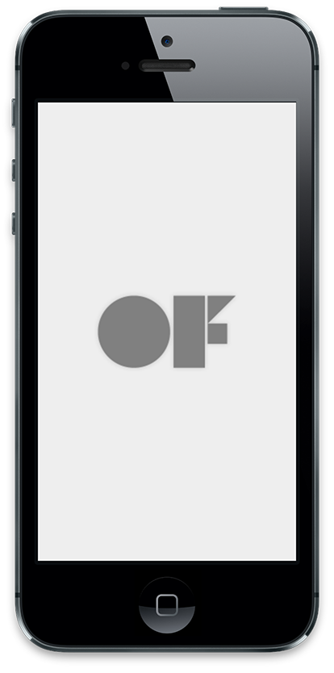
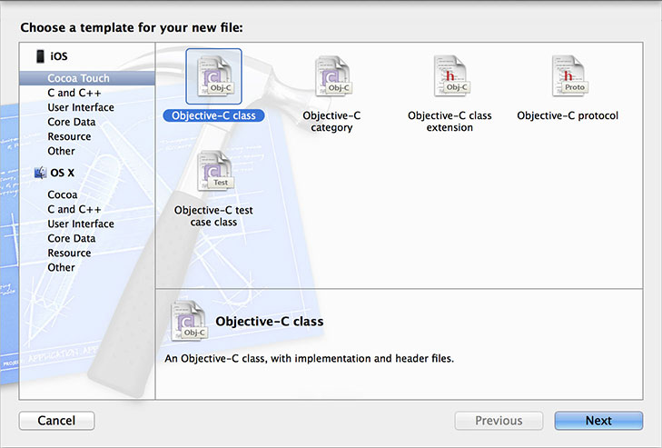
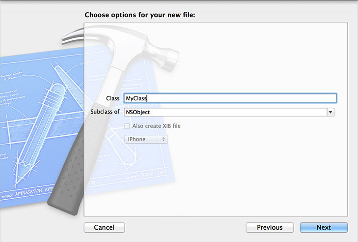
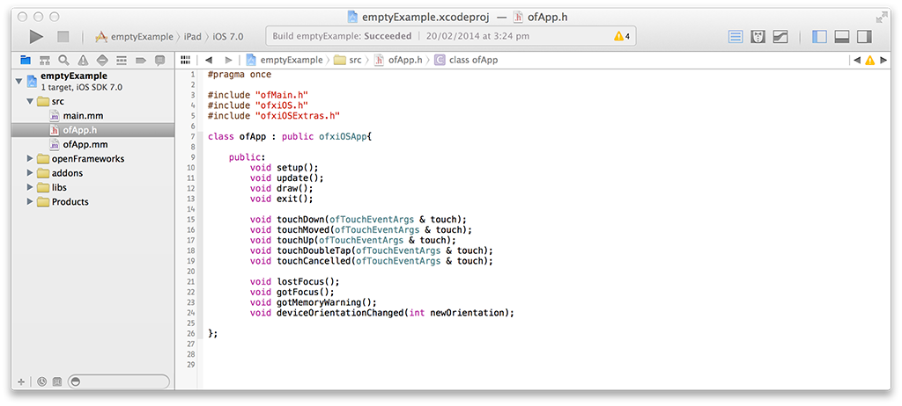
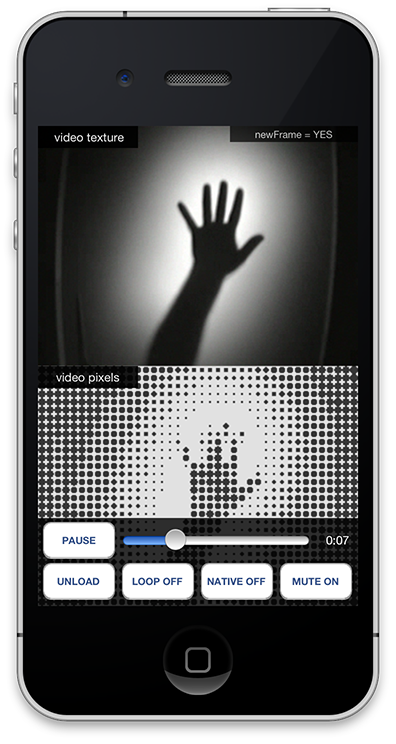
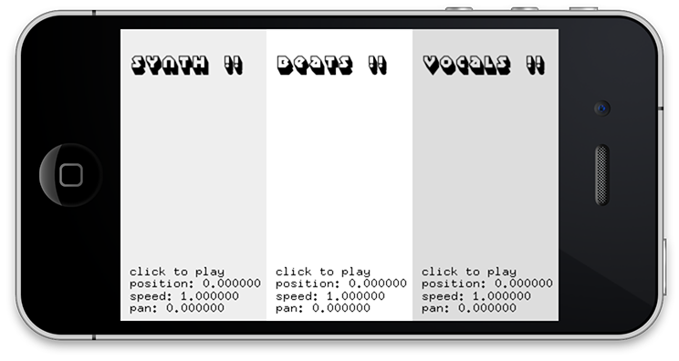
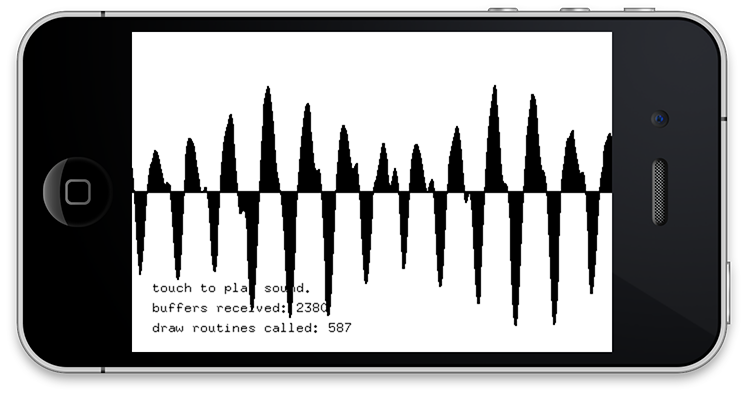
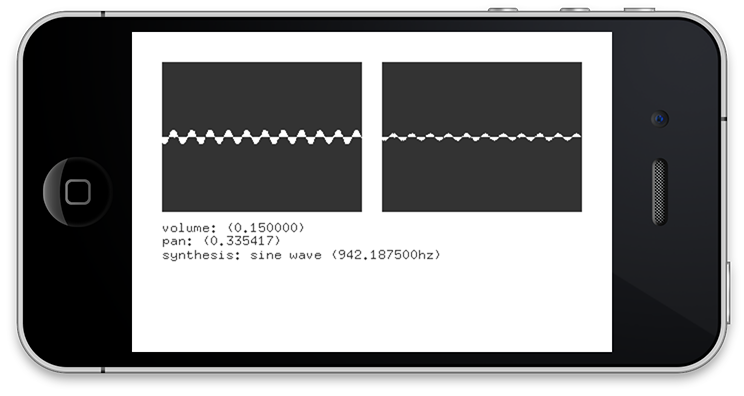

#ofxiOS
##OpenFrameworks on iOS devices.



##Intro
The beauty behind OpenFrameworks is its cross-platform nature and the ability to run the same code on your desktop and mobile devices while achieving the same results.

Support for the iPhone in OpenFrameworks started when the very early iPhones (iPhone 2 or 3 - fact check!) were being released. Some clever people from the OF community realised that the iPhone supported OpenGL which also happened to be what OF was using for rendering graphics, and even more importantly, that C++ code could be mixed with Obj-C code. With these two very important pieces of the puzzle in place it was a matter of tweaking the core OF code to begin it's support for iOS devices. It was then when ofxiPhone was born.

Since then Apple have released a number of other devices like the iPad and so the ofxiPhone title became less accurate and was eventually changed to ofxiOS, OpenFrameworks support for all iOS devices.


##Intro to Objective-C

We've briefly mentioned Objective-C or Obj-C for short and some people may know or may not know what it is. Obj-C is the main programming language used by Apple for OSX and iOS systems. Obj-C is also a superset of the C programming language which makes it possible to compile C and C++ code with an Obj-C compiler, which means its possible to mix OF C++ code with native Obj-C code.

Some people right about now may be letting off long desperate sighs, thinking - "I'm just starting to get my head around C++ and now I have to learn Obj-C... what tha?!" Lucky for you OpenFrameworks has done all the hard work of keeping most Obj-C code hidden so you don't have to worry about it. By using the OpenFrameworks API, you can access most iOS device functionality like the gyro, accelerometer or camera without having to type any Obj-C code what so ever. BUT, the time will come when you're comfortable with the iOS environment and you want to access something really specific, so specific that OF hasn't even considered wrapping for you. In this case you'll need to put your Obj-C hat on and get those hands dirty.

Obj-C syntax can look a little daunting when you first look at it. It certainly scared the hell out of me the first time I saw it. And you may notice its unusually very long which is due to it's very explicit nature, meaning that all function names are very descriptive of the functionality they perform and all those words add up. You may think that it would take longer to work with an explicit language but its actually the opposite, because the functions are easier to find and in XCode you can usually start typing the function you are looking for and XCode will give you a list of suggestions and complete the function name for you.

Like in C++, in Obj-C your code is broken down into two files, the header file and the implementation file. The header file still has the same .h extension but a implementation file has a .m extension. Here is a very basic example of how these two files look like.

I created a class called MyClass which extends a UIView class.

In the header (.h) file below we need to define our class interface and we do this between the `@interface` and `@end` tags. The class interface defines instance variables and public methods, but for now we're going to leave it empty.

```
@interface MyClass : NSObject {
    //
}

@end
```

The implementation (.m) file is where you add your actual code for the methods defined in the header file. The first thing you need to do is import your `MyClass.h` header file which defines the structure and then write your implementation between the `@implementation` and `@end` tags.

```
#import "MyClass.h"

@implementation MyClass

@end
```

Nice thing about XCode is that it makes programming easier by creating the basic structure of a class when you first create it, so you don't have to type out the above code structure everytime. By going to File menu, selecting New and then File... a dialogue will appear showing all the files that XCode can create for you. Select `Objective-C class` and another dialogue will appear where you can name your new Class and specify which Subclass it will extend. MyClass will then be automatically generated, ready for you to enter your code into.




So now that we have the bare bones of our class, lets add some methods and variables to it so it actually does something. Lets start simple and say that MyClass contains two string variables, one for my first name and one for my last name. We will also want to create some methods for setting and retrieving these variables from the class.

MyClass header (.h) file now looks like this,

```
@interface MyClass : NSObject {
    NSString * firstName;
    NSString * lastName;
}

- (void)setFirstName:(NSString *)nameStr;
- (void)setLastName:(NSString *)nameStr;

- (NSString *)getFirstName;
- (NSString *)getLastName;

@end
```

Inside MyClass interface, you can now see two `NSString` variables being defined, `firstName` and `lastName`. `NSString` is the Obj-C equivalent of `string` in C++. The `*` means that `firstName` and `lastName` are pointers to `NSString` objects. In Obj-C, all instance variables are private by default, which means you can not access them directly from outside of the class object, so you need to create accessor methods to set and get these values.

Lets look at how methods are structured in Obj-C and take `setFirstName` as an example,

```
- (void)setFirstName:(NSString *)nameStr;
```

The very first thing that comes before every Obj-C method is a dash `-` or a plus `+`. A dash means that the method is a instance method and a plus means that the method is a class method. Moving across in the brackets we have the return type of the method. In this instance method we are setting the first name and not returning any value, so therefor the return type is `void`. Next is the name of the method `setFirstName` and then separated by a colon `:` are the variables that we pass into the method. In this example we are passing in a `nameStr` variable and we have to specify the type of that variable which is `NSString`.

Now that we have defined our variables and methods in the class interface, lets look at the implementation file where our functional code will live.

```
#import "MyClass.h"

@implementation MyClass

- (void)setFirstName:(NSString *)nameStr {
    [firstName autorelease];
    firstName = [nameStr retain];
}

- (void)setLastName:(NSString *)nameStr {
    [lastName autorelease];
    lastName = [nameStr retain];
}

- (NSString *)getFirstName {
    return firstName;
}

- (NSString *)getLastName {
    return lastName;
}

@end
```

In terms of structure, the methods look almost exactly the same as the in the class interface, only now each method has curly braces on the end `{` and `}` which symbolise the begining and end of the method code. The two getter methods (`getFirstName` and `getLastName`) are pretty straight forward and simply return a pointer to a `NSString` variable. The setter methods (`setFirstName` and `setLastName`) contain code which is more specific to Obj-C and here is where we first touch up the topic of memory managemen in Obj-C. 

Lets look at what is going on inside the `setFirstName` method.

```
[firstName autorelease];
firstName = [nameStr retain];
```

All that the above is doing is assigning a new string value to `firstName` but it's also making sure the previous value is released before a new one is retained to prevent memory leaks. Calling `autorelease` on a object is telling the object to `release` at some stage in the not too distant future when it is no longer being used, usually at the end of the method when it is no longer needed. We then need to `retain` the new string which you can think of as binding it to the `NSString * firstName` pointer reference. Retaining and releasing objects is at the core of the Obj-C memory management and is know as reference counting.

The basic theory behind reference counting is that when ever an object is retained, the reference count goes up by +1 and everytime it is released, the reference count is goes down by -1. When the reference count is back down to zero, the object is released from memory.


NEED TO RECREATE THIS DIAGRAM.

There are a couple way of creating an Obj-C object and we'll use the NSString class to demonstrate. Below is a code sample of how a `NSString` object is created using the `alloc` method. Calling `alloc` on a `NSString` class returns a new `NSString` object. A very important thing to note here is that when an object is created using `alloc`, it's reference count is at +1. So behind the scenes, Obj-C has created a new string object and has already called `retain` on the object for us. The final line in the code example is initialising the string object with some text which says `I'm a string`.

```
firstName = [NSString alloc];
[firstName initWithString:@"I'm a string"];

```

Another way of creating a string is using `NSString` class methods shown in the code sample below. When a object is created using class method, it is created in a `autorelease` state which means it's reference count is at +1 but because it has been marked as `autorelease`, it will be released from memory soon after if not retained. This is why we need to call `retain` on the new string object, so that we can hold onto its reference and use it somewhere else in our code.

```
firstName = [NSString stringWithString:@"I'm a string"];
[firstName retain];
```

The general rule when it comes to Obj-C memory management is if you create an object using the `alloc` method or call `retain` on a object, you have taken responsibility for that object and sometime in the the future you will have to `release` it.

With everything that was just discussed, lets take another look at MyClass which will now include the `init` and `dealloc` methods, the entry and exit points of all Obj-C objects.

```
#import "MyClass.h"

@implementation MyClass

- (id)init {
    self = [super init];
    if(self != nil) {
        firstName = [[NSString alloc] initWithString:@"Lukasz"];
        lastName = [[NSString alloc] initWithString:@"Karluk"];
    }
    return self;
}

- (void)dealloc {
    [firstName release];
    [lastName release];
    [super dealloc];
}

- (void)setFirstName:(NSString *)nameStr {
    [firstName autorelease];
    firstName = [nameStr retain];
}

- (void)setLastName:(NSString *)nameStr {
    [lastName autorelease];
    lastName = [nameStr retain];
}

- (NSString *)getFirstName {
    return firstName;
}

- (NSString *)getLastName {
    return lastName;
}

@end
```

Both the `init` and `dealloc` methods are already defined in every Obj-C object so we are then extending these methods and overriding their behaviour. The `init` method is the first method to be called on every Obj-C object which makes it the ideal place to intialise your variables. The `init` method always returns a reference of itself with type `id`, which in C++ is equivalent to returning `void *`. Because we are extending the `init` method, we need to make sure we call it's super method first, otherwise the object will not initialise correctly. We then make sure that `[super init]` is called successfully without any issues before initialising variables `firstName` and `lastName`. The last thing an `init` method needs to do is return a reference to itself.

The `dealloc` method is called when an object is released from memory, which makes it the place to release any other memory the object is holding onto. `firstName` and `lastName` objects are released and the last order of business is calling the `[super dealloc]` method, before the object is completely removed from memory.

- what does objective-C look like?
- differences between C++ and Obj-C (string, arrays)
- brief overview of Obj-C memory management compared to C++ (retain/release and ARC)
- How C++ and Obj-C can be mixed together. Mention .mm files.

good reference => http://cocoadevcentral.com/d/learn_objectivec/


##Under the Hood

UIKit is the backbone of all iOS apps. It is a collection of classes or framework that provide a standardised structure for creating and running applications. UIKit provides the skeleton structure into which you can insert your custom application code and makes it easy to receive system events like device orientation changes or memory warning as two examples amongst many. 

UIKit organises its classes using the MVC (model-view-controller) design pattern. When you get into iOS programming you will see the MVC patterns everywhere, especially when working with UIViewControllers. MVC breaks up code into one of the three categories and makes the code more extensible and reusable.

When you run a iOS app, it always begins with the UIApplication class which listens for system events and passes them into the app code for further handling. The first class you can start writing your own code into is the Application Delegate. The App Delegate is responsible for creating and managing the UIWindow as well as the root UIViewController, two very important objects in the iOS app structure. UIWindow's job is to coordinate and display content on the screen. As for a UIViewController, you can think of it as a single app screen and using the this analogy the root UIViewController can be thought of as the home screen for the app. The root UIViewController is the bottom most view controller on top of which you can stack other view controllers, aptly named the view controller stack. When stacking UIViewController objects on top of one another you get the beginnings of an app. You now have a few screens with different UIView objects that you can navigate between.

(explain UIViews)

So that's the super compressed summary which is only skiming the surface of iOS development. It can be a very steap learning curve and this is where ofxiOS comes to the rescue as an elevator that takes you straight to the top of that curve. ofxiOS allows you to make native iOS apps using OpenFrameworks without knowing anything about UIKit or Obj-C at all. 

Inside ofxiOS are classes which extend UIKit and take care of creating the iOS application structure. The three core classes are ofxiOSAppDelegate which extends the application delegate, ofxiOSViewController which extends a UIViewController and is the root view controller for an OF application, and ofxiOSEAGLView which extends a UIView and is the view to which OpenGL content is drawn to.

ofxiOSAppDelegate is mainly in responsible for listening to and handling global events like orientation changes, memory warnings, and events for when the application is exited or moves to the background state. ofxiOSAppDelegate alerts the ofApp that that these events have happened and it is then up to the programmer to handle these events as they chose inside the ofApp.

ofxiOSViewController is the OF UIViewController and like the name suggest, its main responsibility is to create and control the OF UIView. It also takes care of orientation changes and can rotate an OF application to match the orientation changes on the device.

ofxiOSEAGLView is the OF UIView which displays all OF rendered content. ofxiOSEAGLView is respinsible for creating a ESRenderer which encapsulates low-level OpenGL setup and makes it possible to render OpenGL graphics into a UIView. ofxiOSEAGLView also listens out for touch events which it passes into the ofApp to be handled by the programmer.

TODO // need to make a diagram to visualise all this.

###ofxiOSApp



When you open up a empty ofxiOS project you will immediatly notice some differences in the ofApp header file. You will see that ofApp extends ofxiOSApp instead of ofBaseApp as you would see when running a desktop app. This is because iOS apps and desktop apps are slightly different, desktop apps receive mouse and keyboard events and iOS apps receive touch events as well a orientation events and memory warnings. To handle these new events, new methods had to be defined inside ofxiOSApp which the ofApp inherits from.

```
void touchDown(ofTouchEventArgs & touch);
void touchMoved(ofTouchEventArgs & touch);
void touchUp(ofTouchEventArgs & touch);
void touchDoubleTap(ofTouchEventArgs & touch);
void touchCancelled(ofTouchEventArgs & touch);
```
Touch events are passed into the ofApp through these methods. Each method receives a ofTouchEventArgs object which contains all the information about the touch event, such as the touch ID and the x and y position of the touch on the screen.

```
void lostFocus();
void gotFocus();
```
Focus events are passed into the ofApp when the application goes from active to inactive state and vise versa. `gotFocus()` method tells the ofApp that the application has becomes active, which happens when the application first launches. `lostFocus()` method tells the ofApp that the application has become inactive which happens when a phone call or SMS interrupts the app or when the user exits the app.

```
void gotMemoryWarning();
```
Each iOS application is allocated a limited amount of memory for it to run. When an application exceeds the allocated amount, the operating systems lets the application know by giving it a memory warning. Memory warnings are passed into the ofApp via the `gotMemoryWarning()` method at which point the application needs to free up some memory otherwise the operating system can terminate the application.

```
void deviceOrientationChanged(int newOrientation);
```
iOS dispatches orientation events when ever the device orientation changes. Orientation events are passed into the ofApp through `deviceOrientationChanged()` method. It is then up to the user to handle these orientation changes as they see fit. iosOrientationExample inside examples/ios/ folder demonstrates how the orientation events can be used.


###OpenGL ES and iOS

- Intro > lead to types
- iOS Support for ES 1.1
- iOS Support for ES 2.0
- iOS Support for ES 2.0 > Lead to Hardware

- Apple Devices Hardware Limitations (A7 VS PowerVR)
	- PowerVR
	- A7 > Lead to Device Specific Limitions
- Device Specific Texture Limitations
	- Ref Apple Docs
	https://developer.apple.com/library/ios/documentation/DeviceInformation/Reference/iOSDeviceCompatibility/OpenGLESPlatforms/OpenGLESPlatforms.html
- Conclusion > Lead to Shaders and Crossovers.


------

- Shaders using ES2. Crossover between web ES2 shaders and iOS ES2 shaders.
- https://www.khronos.org/webgl/wiki/WebGL_and_OpenGL_Differences


##OF & UIKit
- Adding UIViews to an OF app, above and below the OF glView.
- openFrameworks as part of a larger app, several openFrameworks apps in one iOS app
- addons for ofxiOS
- dispatching on main queue from OF to UIKIT using blocks.

http://www.creativeapplications.net/iphone/integrating-native-uikit-to-your-existing-openframeworks-ios-project/


##Media Playback and Capture

A large chunk of ofxiOS support is media playback and capture. ofxiOS has good support for video playback, sound playback, camera capature and sound input. All Obj-C code that makes these features possible is wrapped and abstracted so a regular OF user can continue using the OF API the same way across all supported platforms.

For example, lets say you have a very simple ofApp that plays a video. To achieve this you would use the `ofVideoPlayer` class, create a object instance of the class, call the `loadMovie()` method to load the video file and then call the `play()` method to begin playback of the video. Now to do this across desktop OF apps or iOS OF apps, the code is exactly the same. This is because we are using the `ofVideoPlayer` API which is common across all supported OF platforms. Although the thing to know here is that even though the code works the same way across the different platforms, the actual code used to play a video on OSX and iOS (for example) is very different. 

###ofxiOSVideoPlayer



`ofxiOSVideoPlayer` is the video player class used for video playback inside ofxiOS. When you're using `ofVideoPlayer` inside a iOS OF project, you are actually using `ofxiOSVideoPlayer`. OF automatically selects the correct video player class to use depending on the platform you are using.

A iOS example that demonstrates the use of the video player on iOS can be found in the folder,
examples/ios/moviePlayerExample

When looking inside the ofApp header file you will notice that we are using the `ofxiOSVideoPlayer` class instead the generic `ofVideoPlayer` class. You can use both but it's probably better to use the `ofxiOSVideoPlayer` class instead. The reason being is that `ofxiOSVideoPlayer` has a few extra methods which are specific to iOS, which you may or may not want to use, but it's always good to have that option.

Let go through some of the basic functionality.

To load and play a video it's exactly the same as using the `ofVideoPlayer`.

```
void ofApp::setup() {
	video.loadMovie("hands.m4v");
	video.play();
}
```
On every single frame we need to update the video player.

```
void ofApp::update(){
    video.update();
}
```
And to draw the video to screen, we need to first get a reference to the video texture and call draw on the texture object.

```
void ofApp::draw(){
    video.getTexture()->draw(0, 0);
}
```

Now for those extra iOS specific methods.

If you poke around inside `ofxiOSVideoPlayer` you will see a method called `getAVFoundationVideoPlayer()` which is responsible for returning a reference of the underlaying `AVFoundationVideoPlayer`. `AVFoundationVideoPlayer` is the Obj-C implementation for the iOS video player and is the class that sits below `ofxiOSVideoPlayer` and pretty much does all the work. Now, some reasons you may want have accesss to the `AVFoundationVideoPlayer` is that you want to work directly with the Obj-C code to get the most out of iOS video player features or you want to display the video inside a UIView instead of rendering it to OpenGL.

Here we are getting a pointer reference to the `AVFoundationVideoPlayer` which also happens to extends a `UIView`. This means we can add the video player to a UIView hiarchy and display the video natively.

```
AVFoundationVideoPlayer * avVideoPlayer;
avVideoPlayer = (AVFoundationVideoPlayer *)video.getAVFoundationVideoPlayer();
[avVideoPlayer setVideoPosition:CGPointMake(0, 240)];
[ofxiOSGetGLParentView() insertSubview:avVideoPlayer.playerView belowSubview:controls.view];
```


###ofxiOSVideoGrabber

###ofxiOSSoundPlayer and ofxOpenALSoundPlayer



###ofxiOSSoundStream





##Life Hacks
- ofxiOS utils, ofxiOSExtras, ofxiOSImagePicker, ofxiOSMapKit etc.


##App Store
- App distribution, preparing your OF app for the app store.
- examples of OF iOS apps already in the app store.


##Case Studies

https://itunes.apple.com/au/app/john-lennon-the-bermuda-tapes/id731652276?mt=8

https://itunes.apple.com/au/app/sadly-by-your-side/id687252928?mt=8

https://itunes.apple.com/us/app/swipin-safari/id635434195?mt=8

https://itunes.apple.com/au/app/tunetrace/id638180873?mt=8

https://itunes.apple.com/au/app/hana/id556557031?mt=8

https://itunes.apple.com/gb/app/starry-night-interactive-animation/id511943282

https://itunes.apple.com/au/app/snake-the-planet!/id528414021?mt=8

https://itunes.apple.com/au/app/horizons/id391748891?mt=8

https://itunes.apple.com/us/app/spelltower/id476500832?mt=8