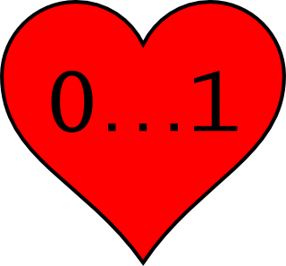
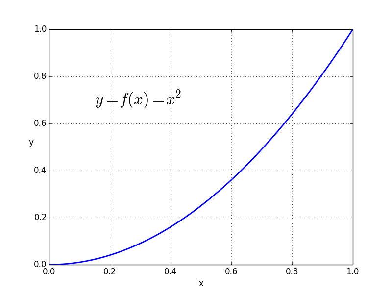
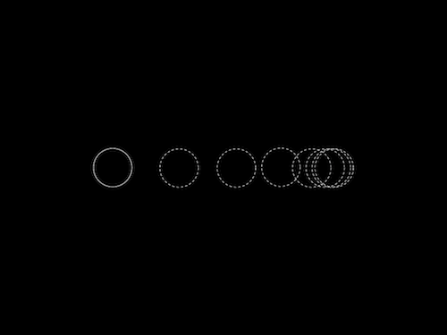
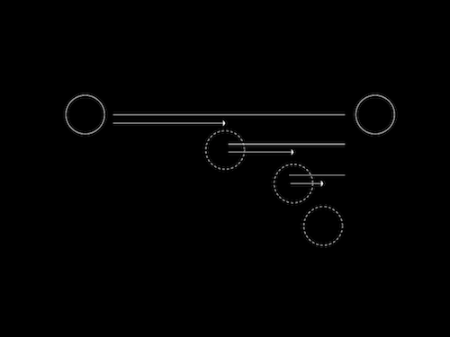
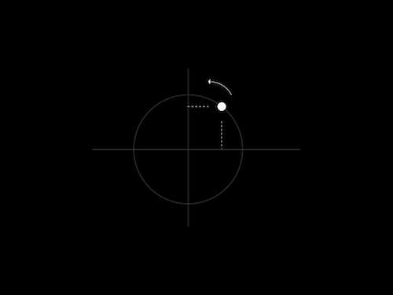
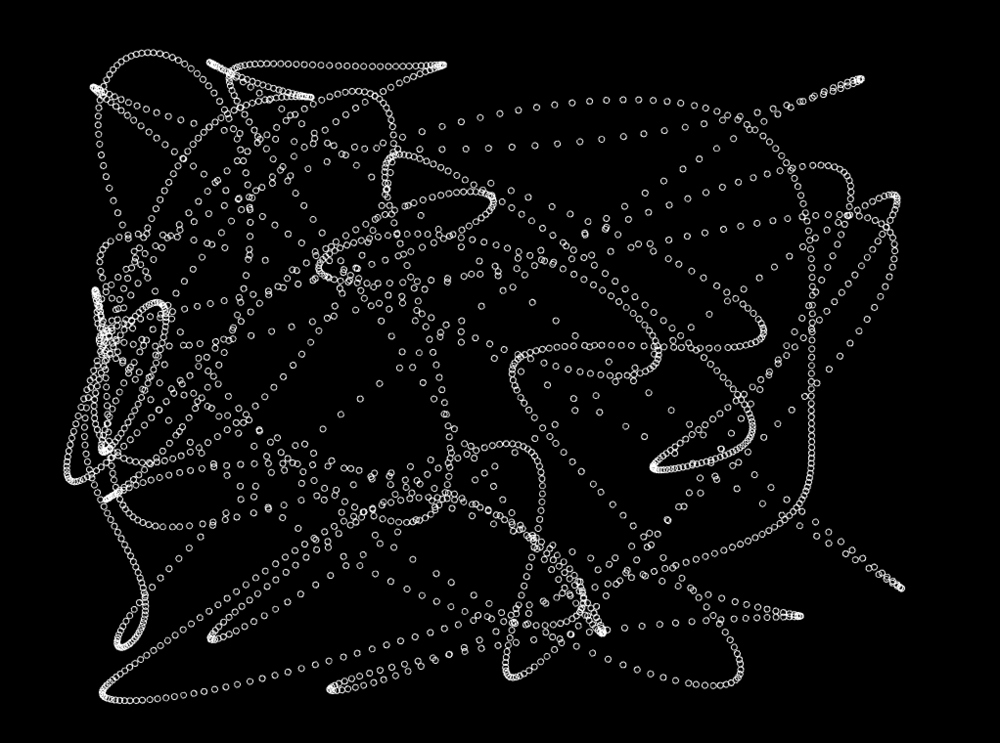
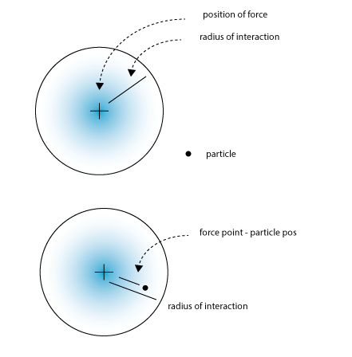

# Animation

*by [Zach Lieberman](http://thesystemis.com)* 

*with edits from Kayla Lewis*

*extensions by tpltnt*

## Background 

The word animation is a medieval term stemming from the Latin animare, which means ‘instill with life’. In modern terms, it's used to describe the process of creating movement from still, sequential images. Early creators of animation used spinning discs ([phenakistoscopes](https://en.wikipedia.org/wiki/Phenakistoscope "Wikipedia on phenakistoscopes") and cylinders ([zoetropes](https://en.wikipedia.org/wiki/Zoetrope "Wikipedia on zoetropes") with successive frames to create the illusion of a smooth movement from persistence of vision. In modern times, we're quite used to other techniques such as [flip books](https://en.wikipedia.org/wiki/Flip_book "Wikipedia on flip books") and cinematic techniques like [stop motion](https://en.wikipedia.org/wiki/Stop_motion "Wikipedia on stop motion"). Increasingly, artists have been using computational techniques to create animation -- using code to "bring life" to objects on the screen over successive frames. This chapter is going to look at these techniques and specifically try to address a central question: how can we create compelling, organic, and even absurd movement through code?

As a side note, I studied fine arts, painting and printmaking, and it was accidental that I started using computers. The moment I saw how you could write code to move something across the screen, even as simple as silly rectangle, I was hooked. I began during the first dot-com era working with Flash / ActionScript and Lingo / Macromedia Director and have never looked back.

This chapter will first explain some basic principles that are useful to understanding animation in oF, then attempt to show a few entrypoints to interesting approaches. 

## Animation in oF / useful concepts: 

### Draw a cycle

The first point to make about animation is that it's based on successive still frames. In openFrameworks we have a certain loop cycle that's based roughly on game programming paradigms. It goes like this: 

- `setup()`
- `update()`
- `draw()`
- `update()`
- `draw()`
- ...

The `setup()` function gets called once, right at the start of an oF apps lifecycle and `update()` / `draw()` get called repeatedly. Sometimes people ask why two functions get called repeatedly, especially if they are familiar with [Processing](http://www.processing.org/ "Processing website"), which has only a setup and a draw command. There are a few reasons. The first is that drawing in OpenGL is asynchronous, meaning there's a chance, when you send drawing code to the computer, that it can return execution back to your program so that it can perform other operations while it draws. The second is that it's generally very practical to have your drawing code separated from your non-drawing code. If you need to quickly debug something – say, for example, your code is running slow – you can comment out the draw function and just leave the update running. It's separating out the update of the world from the presentation and it can often help clean up and organize your code. Think about it like a stop frame animator working with an overhead camera that might reposition objects while the camera is not taking a picture then snap a photograph the moment things are ready. In the update function you would be moving things around and in the draw function you draw things exactly as they are at that moment. 

### Variables

The second point to make about animation is that it requires variables. A variable is a placeholder for a value, which means that you can put the value in and you can also get the value out. Variables are essential for animation since they "hold" value from frame to frame – e.g., if you put a value into a variable in the `setup()` function or `update()` function, you can also get it out from memory in the `draw()` function. Take this example where `xpos` (int) is already defined in the header:

```cpp
void ofApp::setup(){
    xpos = 5;  // vertical start position
    ofBackground(ofColor::black);  // black background
}

void ofApp::update(){
    xpos += 2;
    if(ofGetWitdth()<xPos){  // if vertical position is off the screen (width)
        xPos = 5             // reset vertical position
    }
}

void ofApp::draw(){
    ofSetColor(ofColor::red);  // draw everything in red
    ofCircle(xpos, 100, 10);   // draw a circle at the (variable) vertical position, 100 pixels from the top with a 10 pixel diameter
}
```

In this example a red circle moves from the left to the right on the screen. The vertical position (`xpos`) is an integer and gets set to 5 as the inital value in `setup()`. The `update()` function always adds 2 to the `xpos` variable and stores the new value until it becomes larger than the screen width (`ofGetWidth()`), then the vertical position gets reset. The `draw()` function reads the value stored in the variable `xpos` and draws the red circle accordingly.

### Frame rate

The third point to make about oF and animation is frame rate. We animate in openFrameworks using successive frames. Frame rate refers to how quickly frames get drawn. In oF there are several important functions to know about.

- [`ofGetFrameRate()`](http://openframeworks.cc/documentation/application/ofAppRunner.html#!show_ofGetFrameRate "ofGetFrameRate Documentation Page") returns the current frame rate (in frames per second).
- [`ofSetFrameRate( float targetFrameRate )`](http://openframeworks.cc/documentation/application/ofAppRunner.html#!show_ofSetFrameRate "ofSetFrameRate Documentation Page") sets the maximum frame rate. If the software is animating faster than this, `ofSetFrameRate` will slow it down. Think of it like a speed limit. It doesn't make you go faster, but it prevents you from going too fast. Set the value to 0 to run as fast as possible.

In addition, OpenGL works with an output display and will attempt to synchronize with the refresh rate of the monitor -- sometimes called vertical-sync or vertical blanking. If you don't synchronize with the refresh rate, you can get something called frame tearing, where the non-synchronization can mean frames get drawn before and after a change. This leads to horizontal lines of discontinuity called [screen tearing](https://en.wikipedia.org/wiki/Screen_tearing "Wikipedia on screen tearing").


The image above is from [Vanessaezekowitz](https://commons.wikimedia.org/wiki/User:Vanessaezekowitz "Vanessaezekowitz user page"), licensed under [CC-BY-SA 3.0](https://creativecommons.org/licenses/by-sa/3.0/deed.en "link to CC-BY-SA 3.0 license text").

We have a function in oF for controlling this. Some graphics card drivers (see for example Nvidia's PC drivers) have settings that override application settings, so please be sure to check your driver options.

- [`ofSetVerticalSync (bool bUseSync)`](http://openframeworks.cc/documentation/application/ofAppRunner.html#!show_ofSetVerticalSync "ofSetVerticalSync Documentation Page") set this true if you want to synchronized vertically, false if you want to draw as fast as possible.

By default, oF enables vertical sync and sets a frame rate of 60FPS. You can adjust the VSYNC and frame rate settings if you want to animate faster, but please note that by default oF wants to run as fast as possible. It's not uncommon if you are drawing a simple scene to see frame rates of 800 FPS if you don't have VSYNC enabled (and the frame rate cap set really high or disabled).

Another important point which is a bit hard to cover deeply in this chapter is frame rate independence. If you animate using a simple model -- say for example, you create a variable called `xPos`, increase it by a certain amount every frame and draw it.

```cpp
void testApp::setup(){
    xPos = 100;
}

void testApp::update(){
    xPos += 0.5;
}

void testApp::draw(){
    ofRect(xPos, 100, 10, 10);
}
```

This kind of animation works fine, but it assumes that your frame rate is constant. If your app runs faster, say by jumping from 30fps to 60fps, the object will appear to go twice as fast, since there will be 2x the number of update and draw functions called per second.  Typically more complex animations will be written to take this into account, either by using functions like time (explained below) or mixing the frame rate or elapsed time into your update. For example, a solution might be something like:

```cpp
void testApp::update(){
    xPos += 0.5 * (30.0 / ofGetFrameRate());
}
```

If `ofGetFrameRate()` returns 30, we multiply 0.5 by 1, if `ofGetFrameRate()` returns 60, we multiply it by 1/2, so although we are animating twice as fast, we take half sized steps, therefore effectively moving at the same speed regardless of frame rate.  Frame rate independence is fairly important to think about once you get the hang of things. As observers of animation, we really do feel objects speeding up or slowwing down even slightly, but in this chapter I will skip it for the sake of simplicity in the code.

### Time functions

Finally, there are a few other functions that are useful for animation timing:

- [`ofGetElapsedTimef()`](http://openframeworks.cc/documentation/utils/ofUtils.html#!show_ofGetElapsedTimef "ofGetElapsedTimef Documentation Page") returns the elapsed time in floating point numbers, starting from 0 when the app starts.
- [`ofGetElapsedTimeMillis()`](http://openframeworks.cc/documentation/utils/ofUtils.html#!show_ofGetElapsedTimeMillis "ofGetElapsedTimeMillis Documentation Page") similarly returns the elapsed time starting from 0 in milliseconds.
- [`ofGetFrameNum()`](http://openframeworks.cc/documentation/utils/ofUtils.html#!show_ofGetFrameNum "ofGetFrameNum Documentation Page") returns the number of frames the software has drawn. If you wanted, for example, to do something every other frame you could use the mod operator, e.g., `if (ofGetFrameNum() % 2 == 0)`.

### Objects

In these examples, I'll be using objects pretty heavily. It's helpful to feel comfortable with OOP to understand the code. One object that is used heavily is [`ofPoint`](http://openframeworks.cc/documentation/types/ofPoint.html "ofPoint Documentation Page"), which contains an x,y and z variable. In the past this was called "ofVec3f" (vector of three floating point numbers), but we just use the more convenient ofPoint. In some animation code, you'll see vectors used, and you should know that ofPoint is essentially a vector.

You will also see objects that have basic functionality and internal variables. I will typically have a setup, update and draw inside them. A lot of times, these objects are either made because they are useful recipes to have many things on the screen or they help by putting all the variables and logic of movement in one place. I like to have as little code as possible at the testApp / ofApp level. If you are familiar with ActionScript / Flash, this would be similar to having as a little as possible in your main timeline.


## Linear movement

### Getting from point a to point b

One of the most important things to think about when it comes to animation is answering the simple question:

*How do you get from point A to point B?*

In this chapter we will look at animating movement (changing position over time) but we could very well be animating any other numeric property, such as color, the width or height of a drawn shape, radius of a circle, etc.

The first and probably most important lesson of animation is that we **love** numbers between 0 and 1.



The thing about numbers between 0 and 1 is that they are super easy to use in interesting ways. We typically refer to these kinds of numbers as percent, and you'll see me use the shorthand `pct` in the code – this is a floating point number between 0 and 1. If we wanted to get from point A to point B, we could use this number to figure out how much of one point and how much of another point to use. The formula is this:

```cpp
((1-pct) * A) + (pct * B)
```

To add some detail if we are 0 pct of the way from A to B, we calculate

```cpp
((1-0) * A) + (0 * B)
```

which simplifies to `(1*A + 0*B)` or A. If we are 25 percent of the way, it looks like

```cpp
((1-0.75) * A) + (0.25 * B)
```

which is 75% of A + 25% of B. Essentially by taking a mix, you get from one to the other. The first example (**1_rectangleInterpolate**) shows how this is done.
Describe a new object in the header (rectangle.h):

```cpp
#ifndef RECTANGLE_H
#define RECTANGLE_H

#include "ofMain.h"

class rectangle {

	public:

	rectangle();
	void draw();
	void interpolateByPct(float myPct);

	ofPoint pos;

	ofPoint posa;
	ofPoint	posb;

	float pct;	// what pct are we between "a" and "b"
};

#endif // RECTANGLE_H
```

Fill the implementation file (rectangle.cpp):

```cpp
#include "rectangle.h"

//------------------------------------------------------------------
rectangle::rectangle(){
}

//------------------------------------------------------------------
void rectangle::draw() {
    ofFill();
    ofSetRectMode(OF_RECTMODE_CENTER); // center around the position
    ofSetColor(198,246,55);
    ofRect(pos.x, pos.y, 20,20);
}

//------------------------------------------------------------------
void rectangle::interpolateByPct(float myPct){
    pct = myPct;
    pos.x = (1-pct) * posa.x + (pct) * posb.x;
    pos.y = (1-pct) * posa.y + (pct) * posb.y;

    // this is an alternative way to write above..
    // differe style, but the same mathematically.
    //pos.x = posa.x + (pct) * (posb.x-posa.x);
}
```

The `rectangle` class is used in "testApp.h"

```cpp
#ifndef _TEST_APP
#define _TEST_APP

#include "ofMain.h"
#include "rectangle.h"

class testApp : public ofSimpleApp{

	public:

		void setup();
		void update();
		void draw();

		void keyPressed  (int key);
		void keyReleased (int key);

		void mouseMoved(int x, int y );
		void mouseDragged(int x, int y, int button);
		void mousePressed(int x, int y, int button);
		void mouseReleased();

		rectangle	myRectangle;

		float		pct;
};

#endif
```

and "testApp.cpp"

```cpp
#include "testApp.h"
#include "ofMain.h"

//--------------------------------------------------------------
void testApp::setup(){
	// macs by default run on non vertical sync, which can make animation very, very fast
	// this fixes that:
	ofSetVerticalSync(true);

	// set background:
	ofBackground(30,30,30);

	// set the "a" and "b" positions of the rectangle...
	myRectangle.posa.x = 10;
	myRectangle.posa.y = 10;
	myRectangle.posb.x = 590;
	myRectangle.posb.y = 590;
	myRectangle.interpolateByPct(0);	// start at 0 pct
	pct = 0;				// a variable we can alter...
}

//--------------------------------------------------------------
void testApp::update(){
	// to see pct in the console
	//printf("%f \n", pct);

	pct += 0.01f;		// increase by a certain amount
	if (pct > 1) {
		pct = 0;	// just between 0 and 1 (0% and 100%)
	}
	myRectangle.interpolateByPct(pct);	// go between pta and ptb
}

//--------------------------------------------------------------
void testApp::draw(){
	myRectangle.draw();
}

//--------------------------------------------------------------
void testApp::keyPressed  (int key){
}

//--------------------------------------------------------------
void testApp::keyReleased  (int key){
}

//--------------------------------------------------------------
void testApp::mouseMoved(int x, int y ){
}

//--------------------------------------------------------------
void testApp::mouseDragged(int x, int y, int button){
}

//--------------------------------------------------------------
void testApp::mousePressed(int x, int y, int button){
	//myRectangle.posa.x = x;
	//myRectangle.posa.y = y;
}

//--------------------------------------------------------------
void testApp::mouseReleased(){
}
```

All this is tied together and into openFrameworks via the "main.cpp" file.

```cpp
#include "ofMain.h"
#include "testApp.h"
#include "ofAppGlutWindow.h"

//========================================================================
int main( ){

    ofAppGlutWindow window;
	ofSetupOpenGL(&window, 600,600, OF_WINDOW);			// <-------- setup the GL context

	// this kicks off the running of my app
	// can be OF_WINDOW or OF_FULLSCREEN
	// pass in width and height too:
	ofRunApp( new testApp());
}
```

If everything is working as expected, you should see the following screen:


As a side note, the function `ofMap`, which maps between an input range, uses pct internally. It takes a value, converts it into a percentage based on the input range, and then uses that pct to find the point between the output range. You have seen `ofMap` in the "Graphics" chapter already. More details can be found in the "Math: From 1D to 4D" chapter.

### Curves

One of the interesting properties of numbers between 0 and 1 is that they can be easily adjusted / curved.  

The easiest way to see this is by raising the number to a power.  A power, as you might remember from math class, is multiplying a number by itself,  e.g., 2^3 = `2*2*2 = 8`. Numbers between 0 and 1 have some interesting properties. If you raise 0 to any power it equals 0 (`0*0*0*0 = 0`). The same thing is true for 1 (`1*1*1*1 = 1`), but if you raise a number between 0 and 1 to a power, it changes. For example, 0.5 to the 2nd power = 0.25.

Let's look at a plot of pct raised to the second power: 



The plot shows the graph of a [mathematical function](https://en.wikipedia.org/wiki/Function_%28mathematics%29#Notation "Wikipedia on (the notation of) mathematical functions"), namely `f(x) = y = x²`. Think about the x value of the plot (horizontal axis) as the input and y value as the output (vertical axis). If put in 0, we get out a y value of 0, if we put in 0.1, we get out a y value of 0.01, all the way to putting in a value of 1 and getting out a value of 1. Depending on the mathematical function, you can have different curves and therefore different mapping behaviour.

As a side note, it's important to be aware that things in the world often don't move linearly. They don't take "even" steps. Roll a ball on the floor, it slows down. It's accelerating in a negative direction. Sometimes things speed up, like a baseball bat going from resting to swinging. Curving pct leads to interesting behavior. The objects still take the same amount of time to get there, but they do it in more lifelike, non-linear ways.



If you raise the incoming number between 0 and 1 to a larger power it looks more extreme. Interestingly, if you raise this value between 0 and 1 to a fractional (rational) power (i.e., a power that's less than 1 and greater than 0), it curves in the other direction.  

The next example (**3_rectangleInterpolatePowf**) shows an animation that uses pct again to get from A to B, but in this case, pct is raised to a power:


In **4_rectangleInterpolatePowfMultiple**, you can see a variety of these rectangles, all moving with different shaping functions. They take the same amount of time to get from A to B, but do it in very different ways. I usually ask my students to guess which one is moving linearly -- see if you can figure it out without looking at the code:


Using curves to control change is a very important principle in animation. It is called ["Slow In and Slow Out"](https://en.wikipedia.org/wiki/12_basic_principles_of_animation#Slow_In_and_slow_Out) and is explicitly mentioned as one of the famous "Twelve Basic Principles of Animation" described in the "The Illusion of Life: Disney Animation" book written by Ollie Johnston and Frank Thomas in 1981. It basically says that bodies naturally need time to change their speed and therefore the movement around extreme positions (where change happens) is slower than in the middle of said movement (where no/less change happens).

Raising percent to a power is one of a whole host of functions that are called "shaping functions" or "easing equations." Robert Penner wrote about and derived many of these functions so they are also commonly referred to as "Penner Easing Equations."  [Easings.net](http://easings.net/) is a good resource, as well there are several openFrameworks addons for easing (e.g. [ofxEasingFunc](https://github.com/satoruhiga/ofxEasingFunc "ofxEasingFunc github repository")).

### Zeno

A small twist on the linear interpolation is a technique that I call "Zeno" based on [Zeno of Elea's](https://en.wikipedia.org/wiki/Zeno_of_Elea "Wikipedia on Zeno of Elea") *dichotomy paradox*:

> Imagine there is a runner in a race and the runner covers 1/2 of the distance in a certain amount of time, and then they run 1/2 of the remaining distance in the same amount of time, and run 1/2 of that remaining distance, etc. Do they finish the race?  There is always some portion of the distance left remaining to run one half of. The idea is that you can always keep splitting the distance.

If we take the linear interpolation code but always alter our own position instead (e.g., take 50% of our current position + 50% of our target position), we can animate our way from one value to another. I usually explain the algorithm in class by asking someone to do this:

1. Start at one position in your room.
2. Pick a point to move to.
3. Calculate the distance between your current position and that point.
4. Move 50% closer.
5. Go to (3).



In code, that's basically the same as saying

```cpp
currentValue = currentValue + ( targetValue - currentValue ) * 0.5.
```

In this case `targetValue - currentValue` is the distance. You could also change the size of the step you make every time, for example, taking steps of 10% instead of 50%:

```cpp
currentValue = currentValue + ( targetValue - currentValue ) * 0.1.
```

If you expand the expression, you can write the same thing this way:

```cpp
currentValue = currentValue * 0.9 + targetValue * 0.1.
```

This is a form of smoothing: you take some percentage of your current value and another percentage of the target and add them together. Those percentages have to add up to 100%, so if you take 95% of the current position, you need to take 5% of the target (e.g., currentValue * 0.95 + target * 0.05).

In Zeno's paradox, you never actually get to the target, since there's always some remaining distance to go. On the computer, since we are dealing with pixel positions on the screen and floating point numbers at a specific range, the object appears to stop.

In the 5th example (**5_rectangleZeno**), we add a function to the rectangle that uses zeno to catch up to a point:

```cpp
void rectangle::zenoToPoint(float catchX, float catchY){
    pos.x = catchUpSpeed * catchX + (1-catchUpSpeed) * pos.x; 
    pos.y = catchUpSpeed * catchY + (1-catchUpSpeed) * pos.y; 
}
```

Here, we have a value, `catchUpSpeed`, that represents how fast we catch up to the object we are trying to get to. It's set to 0.01 (1%) in this example code, which means take 99% of my own postion, 1% of the target position and move to their sum. If you alter this number you'll see the rectangle catch up to the mouse faster or slower. A value of 0.001 means it will run 10 times slower, a value of 0.1 means ten times faster.

This technique is very useful if you are working with noisy data -- a sensor for example. You can create a variable that catches up to it using zeno and smoothes out the result. I use this quite often when I'm working with hardware sensors / physical computing, or when I have noisy data. The nice thing is that the catch up speed becomes a knob that you can adjust between more real-time (and more noisy data) and less real-time (and more smooth) data. Having that kind of control comes in handy!

## Function based movement

In this section of the book we'll look at a few examples that show function based movement, which means using a function that takes some input and returns an output that we'll use for animation. For input, we'll be passing in counters, elapsed time, position, and the output we'll use to control position.

### Sine and Cosine

Another interesting and simple system to experiment with motion in openFrameworks is using [`sin(...)`](http://www.cplusplus.com/reference/cmath/sin/ "C++ sin() documentation page") and [`cos(...)`](http://www.cplusplus.com/reference/cmath/cos/ "C++ cos() documentation page)").

`Sin(...)` and `cos(...)` (sine and cosine) are [trigonometric functions](https://en.wikipedia.org/wiki/Trigonometric_functions "Wikipedia on trigonometric functions"), which means they are based on angles. They are the x and y position of a point moving with a constant radius and rate around a circle. The circle is a unit circle with a radius (r) of 1, which means the diameter is `2*r*PI` or `2*PI`. In oF you'll see this constant as `TWO_PI`, which is 6.28318... 

*As a side note, sometimes it can be confusing that some functions in oF take degrees where others take radians. `Sin(...)` and `cos(...)` are part of the math library, so they take radians, whereas most OpenGL rotation takes degrees. We have some helper constants such as `DEG_TO_RAD` and `RAD_TO_DEG`, which can help you convert one to the other.*

Here's a simple drawing that helps explain sine and cosine.



All you have to do is imagine a unit circle, which has a radius of 1 and a center position of 0,0. Now, imagine a point moving counterclockwise around that point at a constant speed and distance. If you look at the height of that point, it goes from 0 at the far right (3 o'clock position), up to 1 at the top (12 o'clock), back at 0 at the left (9 o'clock) and down to -1 at the bottom (6 o'clock). So it's a smooth, curving line that moves between -1 and 1. That's it. The sine is the height of this dot and the cosine is the horizontal position of this dot. At the far right, where the height of this dot is 0, the horizontal position is 1. When the sine is 1, the cosine is 0, etc. They are in sync, but shifted.

#### Simple examples

It's pretty easy to use `sin(...)` to animate the position of an object.  

Here, we'll take the sine of the elapsed time `sin(ofGetElpasedTimef())`. This returns a number between negative one and one. It does this every 6.28 seconds. We can use ofMap to map this to a new range. For example

```cpp
void ofApp::draw(){
    float xPos = ofMap(sin(ofGetElpasedTimef()), -1, 1, 0, ofGetWidth());
    ofRect(xPos, ofGetHeight/2, 10,10);
}
```

This draws a rectangle which moves sinusoidally across the screen, back and forth every 6.28 seconds. 

You can do simple things with offsets to the phase (how shifted over the sine wave is). In example 7 (**7_sinExample_phase**), we calculate the sine of the time twice, but at the second instance, we add PI: `ofGetElapsedTimef() + PI`. This means the two values will be offset from each other by 180 degrees on the circle (imagining our dot, when one is far right, the other will be far left. When one is up, the other is down). Here we set the background color and the color of a rectangle using these offset values. It's useful if you start playing with sine and cose to manipulate phase.

```cpp
//--------------------------------------------------------------
void testApp::draw(){
    float sinOfTime               = sin( ofGetElapsedTimef() );
    float sinOfTimeMapped         = ofMap(sinOfTime, -1, 1, 0, 255);

    ofBackground(sinOfTimeMapped, sinOfTimeMapped, sinOfTimeMapped);

    float sinOfTime2              = sin( ofGetElapsedTimef() + PI);
    float sinOfTimeMapped2        = ofMap(sinOfTime2, -1, 1, 0, 255);

    ofSetColor(sinOfTimeMapped2, sinOfTimeMapped2, sinOfTimeMapped2);
    ofRect(100,100,ofGetWidth()-200, ofGetHeight()-200);
}
```

*As a nerdy detail, floating point numbers are not linearly precise, e.g., there's a different number of floating point numbers between 0.0 and 1.0 than 100.0 and 101.0. You actually lose precision the larger a floating point number gets, so taking the sine of elapsed time can start looking crunchy after some time. For long running installations I will sometimes write code that looks like* `sin((ofGetElapsedTimeMillis() % 6283) / 6283.0)` *or something similar, to account for this. Even though `ofGetElapsedTimef()` gets larger over time, it's a worse and worse input to `sin(...)` as it grows. `ofGetElapsedTimeMillis()` doesn't suffer from this problem since it's an integer number and the number of integers between 0 and 10 is the same as between 1000 and 1010.*

#### Circular movement

Since sine and cosine are derived from the circle, we can use them to move things in a circular way. We have four variables we need to know: 

- the origin of the circle (`xOrig`, `yOrig`)
- the radius of the circle (`radius`)
- the angle around the circle (`angle`)

The formula is fairly simple: 

```cpp
xPos = xOrig + radius * cos(angle);
yPos = yOrig + radius * sin(angle);
```

This allows us to create something moving in a circular way. In the circle example (**12_sinExample_circlePlusPath**), I will animate using this approach.  

```cpp
float xorig = 500;
float yorig = 300;
float angle = ofGetElapsedTimef()*3.5;
float x = xorig + radius * cos(angle);
float y = yorig + radius * sin(angle);
```

*Note: In oF, the top left corner is 0,0 (y axis is increasing as you go down) so you'll notice that the point travels clockwise instead of counterclockwise. If this bugs you (since above, I asked you imagine it moving counterclockwise) you can modify this line `float y = yorig + radius * sin(angle)` to `float y = yorig + radius * -sin(angle)` and see the circle go in the counterclockwise direction.*

For these examples, I start to add a "trail" to the object by using the [ofPolyline](http://openframeworks.cc/documentation/graphics/ofPolyline.html "ofPolyline Documentation Page") object. I keep adding points, and once I have a certain number I delete the oldest one. This helps us better see the motion of the object. 

If we increase the radius, for example by doing: 

```cpp
void testApp::update(){
    radius = radius + 0.1;
}
```

we get spirals. 

#### Lissajous figures

Finally, if we alter the angles we pass in to x and y for this formula at different rates, we can get interesting figures, called ["Lissajous" figures](https://en.wikipedia.org/wiki/Lissajous_curve "Wikipedia on Lissajouse figures"), named after the French mathematician, Jules Antoine Lissajous. These formulas look cool. Oftentimes I joke with my students in algorithm class about how this is really a course to make cool screen savers. 

### Noise

Noise is similar to sine/cosine in that it's a function taking some input and producing output, which we can then use for movement. In the case of sine/cosine you are passing in an angle and getting a result back that goes back and forth between -1 and 1. In openFrameworks we wrap code using [simplex noise](https://en.wikipedia.org/wiki/Simplex_noise "Wikipedia on simplex noise"), which is comparable to [Perlin noise](https://en.wikipedia.org/wiki/Perlin_noise "Wikipedia on Perlin noise") and we have a function [`ofNoise()`](http://openframeworks.cc/documentation/math/ofMath.html#!show_ofNoise "ofNoise Documentation Page") that takes an input and produces an output. Both algorithms (Perlin, Simplex) provide a pseudo random noise pattern -- they are quite useful for animation, because they are continuous functions, unlike [ofRandom](http://openframeworks.cc/documentation/math/ofMath.html#!show_ofRandom "ofRandom Documentation Page") for example, which just returns random values.  

When I say continuous function, what I mean is if you pass in smaller changes as input, you get smaller output and if you pass in the same value you get the same result. For example, `sin(1.7)` always returns the same value, and `ofNoise(1.7)` also always returns the same result. Likewise if you call `sin(1.7)` and `sin(1.75)` you get results that are continuous (meaning, you can call `sin(1.71) sin(1.72)... sin(1.74)` to get intermediate results).

You can do the same thing with ofNoise -- here, I write a for loop to draw noise as a line. `ofNoise` takes an input, here i/10 and produces an output which is between 0 and 1.  [`ofSignedNoise`](http://openframeworks.cc/documentation/math/ofMath.html#!show_ofSignedNoise "ofSignedNoise Documentation Page") is similar but it produces an output between -1 and 1.


```cpp
ofBackground(0,0,0);
ofSetColor(255);

ofNoFill();
ofBeginShape();
for (int i = 0; i < 500; i++){
    float x = i;
    float noise = ofNoise(i/10.0);
    float y = ofMap(noise, 0,1, 0, 100);
    ofVertex(x,y);
}
ofEndShape();
```

If you alter the i/10.0, you can adjust the scale of the noise, either zooming in (ie, i/100.0), so you see more details, or zooming out (ie, i/5.0) so you see more variation. 


We can use noise to animate. Here, for example, we move an object on screen using noise:

```cpp
float x = ofMap( ofNoise( ofGetElapsedTimef()), 0, 1, 0, ofGetWidth());
ofCircle(x,200,30);
```

If we move y via noise, we can take a noise input value somewhere "away" from the x value, ie further down the curved line:

```cpp
float x = ofMap( ofNoise( ofGetElapsedTimef()), 0, 1, 0, ofGetWidth());
float y = ofMap( ofNoise( 1000.0+ ofGetElapsedTimef()), 0, 1, 0, ofGetHeight());
ofCircle(x,y,30);
```

Alternatively, ofNoise takes multiple dimensions. Here's a quick sketch moving something in a path via ofNoise using the 2d dimensions:



The code for this example (note the 2 inputs into ofNoise, this is a 2-dimensional noise call. It allows us to use the same value for time, but get different results):

```cpp
//--------------------------------------------------------------
void ofApp::setup(){
    ofBackground(0);
    ofSetBackgroundAuto(false);
}

//--------------------------------------------------------------
void ofApp::update(){
}

//--------------------------------------------------------------
void ofApp::draw(){

    float x = ofMap( ofNoise( ofGetElapsedTimef()/2.0, -1000), 0, 1, 0, ofGetWidth());
    float y = ofMap( ofNoise( ofGetElapsedTimef()/2.0, 1000), 0, 1, 0, ofGetHeight());
    ofNoFill();
    ofCircle(x,y,3);

}
```

There's a ton more we can do with noise, we'll leave it for now but encourage you to look at the noise examples that come with openFrameworks, which show how noise can be use to create lifelike movement. Also, we encourage readers to investigate the work of [Ken Perlin](http://mrl.nyu.edu/~perlin/), author of the simplex noise algorithm -- he's got great examples of how you can use noise in creative, playful ways.


## Simulation

If you have a photograph of an object at one point in time, you know its position. If you have a photograph of an object at another point in time and the camera hasn't changed, you can measure its velocity, i.e., its change in distance over time. If you have a photograph at three points in time, you can measure its acceleration, i.e., how much the speed changing over time.  

The individual measurements compared together tell us something about movement. Now, we're going to go in the opposite direction. Think about how we can use measurements like speed and acceleration to control position.

If you know how fast an object is traveling, you can determine how far it has traveled in a certain amount of time. For example, if you are driving at 50 miles per hour (roughly 80km / hour), how far have you traveled in one hour? That's easy. You've traveled 50 miles. How far have you traveled in two or three hours? There is a simple equation to calculate this distance:

```cpp
position = position + (velocity * elapsed time)
```

e.g.: 

```cpp
position = position + 50 * 1;   // for one hour away
```

or

```cpp
position = position + 50 * 2;   // for two hours driving

```

The key expression -- position = position + velocity -- in shorthand would be `p=p+v`.

*Note that the elapsed time part is important. When we animate we'll be doing `p=p+v` quite regularly and you may see us drop this to simplify things (assume every frame has an elapsed time of one). This isn't entirely accurate but it keeps things simple. See the previous section on frame rate (and frame rate independence) for more details.*

In addition, if you are traveling at 50 miles per hour (apologies to everyone who thinks in km!) and you accelerate by 5 miles per hour, how fast are you driving in 1 hr? The answer is 55 mph. In 2 hrs, you'd be traveling 60 mph. In these examples, you are doing the following:

```cpp
velocity = velocity + acceleration
```

In shorthand, we'll use `v=v+a`. So we have two important equations for showing movement based on speed:

```cpp
p = p + v;   // position = position + velocity
v = v + a;   // velocity = velocity + acceleration
```

The amazing thing is that we've just described a system that can use acceleration to control position. Why is this useful? It's useful–if you remember from physics class–because Newton had very simple laws of motion, the second of which says

```cpp
Force = Mass x Acceleration
```

In shorthand, `F = M x A`. This means force and acceleration are linearly related. If we assume that an object has a mass of one, then force equals acceleration. This means we can use force to control velocity and velocity to control position.

The cool, amazing, beautiful thing is there are plenty of forces we can apply to an object, such as spring forces, repulsion forces, alignment forces, etc.

I have several particle examples that use this approach, and while I won't go deeply into them, I'll try to explain some interesting ideas you might find.

### Particle class

The particle class in all of the examples is designed to be pretty straight forward.  Let's take a look at the header (.h) file:

```cpp
class particle{

    public:

        particle();
        void setInitialCondition(float px, float py, float vx, float vy);

        void resetForce();
        void addForce(float x, float y);
        void addDampingForce();

        void update();
        void draw();

        ofPoint pos;
        ofPoint vel;
        ofPoint frc;  
        float damping;
};
```

For variables, it has [ofPoint](http://openframeworks.cc/documentation/types/ofPoint.html "ofPoint Documentation Page") objects for position, velocity and force (abbreviated as `pos`, `vel` and `frc`). It also has a variable for damping, which represents how much this object slows down over time. A damping of 0 would mean not slowing down at all, and as damping gets higher, it's like adding more friction - imagine rolling a ball on ice, concrete or sand. It would slow down at different rates.

In terms of functions, it has a [constructor](https://en.wikipedia.org/wiki/Constructor_%28object-oriented_programming%29 "Wikipedia on constructors") which sets some internal variables like `damping` and a `setInitialCondition(...)` that allows you to set the position and velocity of the particle. Think about this as setting up its initial state, and from here you let the particle play out. The next three functions are about forces (we'll see more) -- the first one, `resetForce()`, clears all the internal force variable `frc`. Forces are not cumulative across frames, so at the start of every frame we clear it. `addForce(...)` adds a force in a given direction, useful for constant forces, like gravity. `addDampingForce()` adds a force opposite velocity (damping is a force felt opposite the direction of travel). Finally, update takes force and adds it to velocity, and takes velocity and adds it to position. Draw just draws a dot where position is.

The particle class is really simple, and throughout these examples, we add complexity to it. In general, the formula you will see in all the examples is

```cpp
for (int i = 0; i < particles.size(); i++){
    particles[i].resetForce();
}

// <------ magic happens here --------->

for (int i = 0; i < particles.size(); i++){
    particles[i].update();
}
```

where the magic is happening between the `resetForce()` and `update()`. Although these examples increase in complexity, they do so simply by adding new functions to the particle class, and adding more things between reset and update.

**[note: add screenshot of simple particle examples]**

### Simple forces, repulsion and attraction

In the next few examples, I added a few functions to the particle object:

```cpp
void addRepulsionForce( float px, float py, float radius, float strength);
void addAttractionForce( float px, float py, float radius, float strength);
void addClockwiseForce( float px, float py, float radius, float strength);
void addCounterClockwiseForce( float px, float py, float radius, float strength);
```

They essentially add forces the move towards or away from a point that you pass in, or in the case of clockwise forces, around a point.



The calculation of these forces is fairly straightforward - first, we figure out how far away a point is from the center of the force. If it's outside of the radius of interaction, we disregard it. If it's inside, we figure out its percentage, i.e., the distance between the force and the particle divided by the radius of interaction. This gives us a number that's close to 1 when we are towards the far edge of the circle and 0 as we get towards the center. If we invert this, by taking 1 - percent, we get a number that's small on the outside, and larger as we get closer to the center.

This is useful because oftentimes forces are proportional to distance.  For example, a magnetic force will have a radius at which it works, and the closer you get to the magnet the stronger the force. 

Here's a quick look at one of the functions for adding force: 

```cpp
void particle::addAttractionForce( float px, float py, float radius, float strength){

    ofVec2f posOfForce;
    posOfForce.set(px, py);
    ofVec2f diff = pos - posOfForce;

    if (diff.length() < radius){ 
        float pct = 1 - (diff.length() / radius);
        diff.normalize();
        frc.x -= diff.x * pct * strength;
        frc.y -= diff.y * pct * strength;
    }
} 
```

`diff` is a line between the particle and the position of the force. If the length of diff is less than the radius, we calculate the pct as a number that goes between 0 and 1 (0 on the outside of the radius of interaction, 1 as we get to the center of the force). We take the line `diff` and normalize it to get a "directional" vector, its magnitude (distance) is one, but the angle is still there. We then multiply that by pct * strength to get a line that tells us how to move. This gets added to our force.

You'll notice that all the code is relatively similar, but with different additions to force. For example, repulsion is just the opposite of attraction:

```cpp
frc.x += diff.x * pct * strength;
frc.y += diff.y * pct * strength;
```

We just move in the opposite direction. For the clockwise and counterclockwise forces we add the perpendicular of the diff line. The perpendicular of a 2D vector is just simply switching x and y and making one of them negative.

**[more: show example]**

### Particle interaction

Now that we have particles interacting with forces, the next step is to give them more understanding of each other. For example, if you have a broad attraction force, they will all converge on the same point without any respect for their neighbors. The trick is to add a function that allows the particle to feel a force based on their neighbor.

We've added new functions to the particle object (looking in the header file):

```cpp
void addRepulsionForce(particle &p, float radius, float scale);
void addAttractionForce(particle &p, float radius, float scale);
```

This looks really similar to the code before, except here we pass in a particle instead of an x and y position. You'll notice that we pass by reference (using &) as opposed to passing by copy. This is because internally we'll alter both the particle which has this function called as well as particle `p` -- i.e., if you calculate A vs B, you don't need to calculate B vs A.

```cpp
void particle::addRepulsionForce(particle &p, float radius, float scale){

    // ----------- (1) make a vector of where this particle p is: 
    ofVec2f posOfForce;
    posOfForce.set(p.pos.x,p.pos.y);

    // ----------- (2) calculate the difference & length
    ofVec2f diff    = pos - posOfForce;
    float length    = diff.length();

    // ----------- (3) check close enough
    bool bAmCloseEnough = true;
    if (radius > 0){
        if (length > radius){
            bAmCloseEnough = false;
        }
    }

    // ----------- (4) if so, update force
    if (bAmCloseEnough == true){
        float pct = 1 - (length / radius);  // stronger on the inside
        diff.normalize();
        frc.x = frc.x + diff.x * scale * pct;
        frc.y = frc.y + diff.y * scale * pct;
        p.frc.x = p.frc.x - diff.x * scale * pct;
        p.frc.y = p.frc.y - diff.y * scale * pct;
    }
}
```

The code should look very similar to before, except with these added lines:

```cpp
frc.x = frc.x + diff.x * scale * pct;
frc.y = frc.y + diff.y * scale * pct;
p.frc.x = p.frc.x - diff.x * scale * pct;
p.frc.y = p.frc.y - diff.y * scale * pct;
```

This is modifying both the particle you are calling this on and the particle that is passed in.

This means we can cut down on the number of particle interactions we need to calculate:

```cpp
for (int i = 0; i < particles.size(); i++){
    for (int j = 0; j < i; j++){
        particles[i].addRepulsionForce(particles[j], 10, 0.4);
    }
}
```

You'll notice in this 2D for loop, the inner loop counts up to the outer loop, so when `i` is 0, we don't even do the inner loop. When `i` is 1, we compare it to 0 (1 vs. 0). When i is 2, we compare it to 0 and 1 (2 vs. 0, 2 vs. 1). This way we never compare a particle with itself, as that would make no sense (although we might know some people in our lives that have a strong self attraction or repulsion).

**[note: maybe a diagram to clarify]**

One thing to note is that even though we've cut down the number of calculations, it's still quite a lot! This is a problem that doesn't scale linearly. In computer science, you talk about a problem using "O" notation, i.e. [big O notation](https://en.wikipedia.org/wiki/Big_O_notation "Wikipedia on big O notation"). This is a bit more like O^2 / 2 -- the complexity is approximately 1/2 of a square. If you have 100 particles, you are doing almost 5000 calculations (100 * 100 / 2). If you have 1000 particles, it's almost half a million. Needless to say, lots of particles can get slow...

We don't have time to get into it in this chapter, but there are different approaches to avoiding that many calculations. Many of them have to deal with spatial hashing, ways of quickly identifying which particles are far away enough to not even consider (thus avoiding a distance calculation).

### local interactions lead to global behavior


## Where to go further

### openFrameworks / animation in general

* [OpenFrameworks / Animation by Code](https://github.com/bschorr/OFAnimation_Spring2015 "OpenFrameworks / Animation by Code course at Parsons The New School for Design, Spring 2015") (course at Parsons The New School for Design, Spring 2015)
* [ofxAddons: animation](http://www.ofxaddons.com/categories/7-animation "ofxAddons for animation")
* [Wikipedia animations portal](https://en.wikipedia.org/wiki/Portal:Animation)
* [Wikipedia book: Animation](https://en.wikipedia.org/wiki/Book:Animation)
* [easings.net](http://easings.net/) resource for shaping/easing functions
* ["Interpolation Tricks or How I Learned to Stop Worrying and Love the 0..1 Range"](http://sol.gfxile.net/interpolation/) is another resource for shaping/easing functions
* [Blender](http://blender.org/) animation tutorial: [Principles of Animation](http://wiki.blender.org/index.php/Doc:2.4/Tutorials/Animation/BSoD/Principles_of_Animation)
* Thomas, Frank; Ollie Johnston, The Illusion of Life: Disney Animation, Hyperion, ISBN 978-0-7868-6070-8

### Mathematical concepts

* Sato Masahiko Laboratory, [Mathematical Curves Hidden Around Us](http://www.masahicom.com/blog/index.cgi/books/20100817mathematicalcurves_dvdbook.htm)
* [Tristam MacDonald](http://www.gamedev.net/user/6-dave-astle), [Spatial Hashing](http://www.gamedev.net/page/resources/_/technical/game-programming/spatial-hashing-r2697)
* [Sylvain Lefebvre](http://www-sop.inria.fr/reves/personnel/Sylvain.Lefebvre/), [Hugues Hoppe](http://research.microsoft.com/~hoppe/): [Perfect spatial hashing](http://research.microsoft.com/en-us/um/people/hoppe/proj/perfecthash/), ACM Trans. Graphics (SIGGRAPH), 25(3), 2006.
* [Simon Wittber](http://entitycrisis.blogspot.com/), [Spatial Hashing](http://entitycrisis.blogspot.de/2007/11/spatial-hashing.html)

### Physics and animation libraries

* [Bullet Physics Library](http://www.bulletphysics.org/ "Bullet Physics Library website")
* [Box2D](http://www.box2d.org/ "Box2D website")
* [Chipmunk2D](http://chipmunk-physics.net/ "Chipmunk2D website")
* [Newton Game Dynamics](http://www.newtondynamics.com/ "Newton Game Dynamics website")
* [Open Dynamics Engine](http://www.ode.org/ "Open Dynamics Engine website")
* [Physics Abstraction Layer](http://www.adrianboeing.com/pal/index.html "Physics Abstraction Layer website")
* [SICONOS - SImulation and COntrol of NOnsmooth Systems](http://siconos.gforge.inria.fr/ "SICONOS webiste")
* [Tokamak Game Physics SDK](http://www.tokamakphysics.com/ "Tokamak Game Physics SDK website")
* [SOFA - Simulation Open Framework Architecture](http://www.sofa-framework.org/ "SOFA website")
