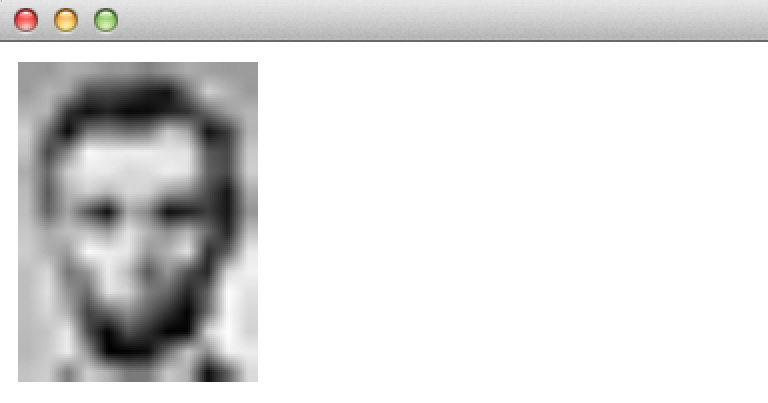
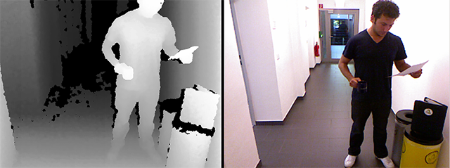
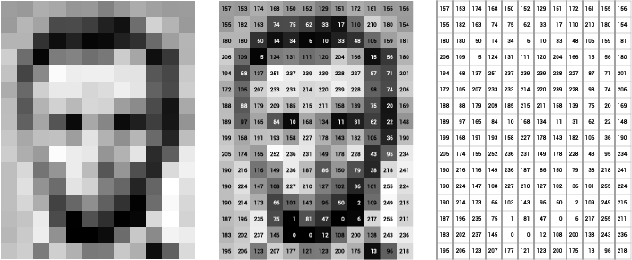
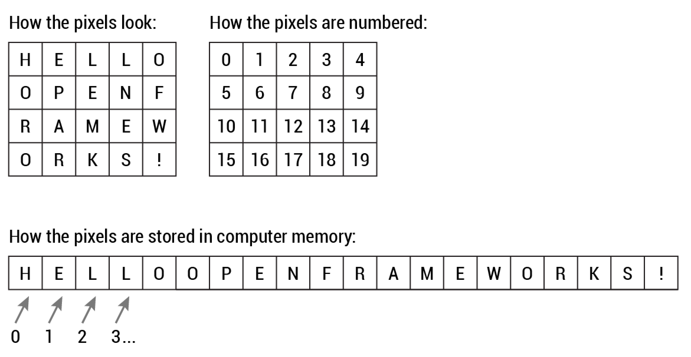
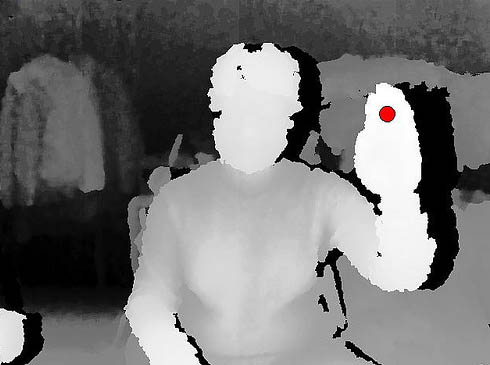
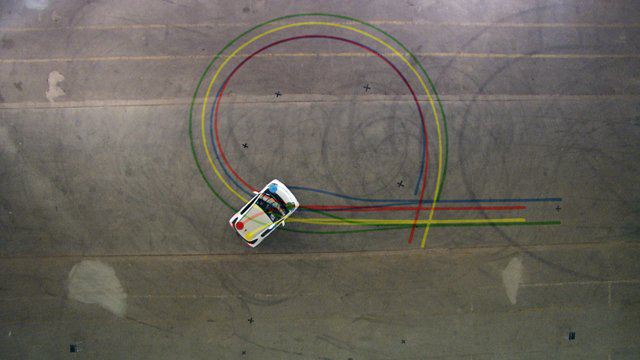
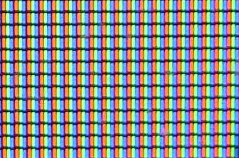
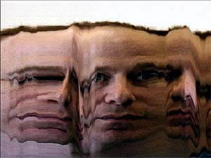
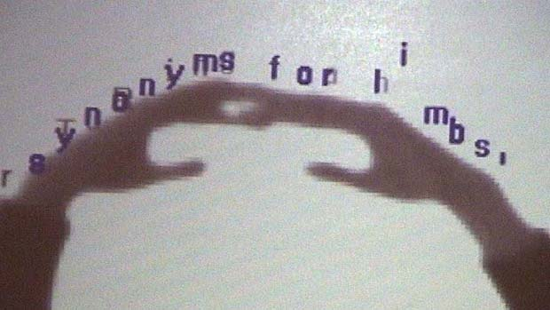

# Image Processing and Computer Vision

By [Golan Levin](http://www.flong.com/)

Edited by [Brannon Dorsey](http://brannondorsey.com)

## Preliminaries to Image Processing

### Digital image acquisition and data structures

This chapter introduces techniques for manipulating (and extracting certain kinds of information from) *raster images*. Such images are sometimes also known as *bitmap images* or *pixmap images*, though we'll just use the generic term **image** to refer to any array (or *buffer*) of numbers that represenRat the color values of a rectangular grid of *pixels* ("picture elements"). In openFrameworks, such buffers come in a variety of flavors, and are used within (and managed by) a wide variety of convenient container objects, as we shall see.

#### Loading and Displaying an Image

Image processing begins with, well, *an image*. Happily, loading and displaying an image is very straightforward in OF. Let's start with this tiny, low-resolution (12x16 pixel) grayscale portrait of Abraham Lincoln:


Below is a simple application for loading and displaying an image, very similar to the *imageLoaderExample* in the OF examples collection. The header file for our program, *ofApp.h*, declares an instance of an `ofImage` object, *myImage*:

```cpp
// Example 1: Load and display an image.
// This is ofApp.h

#pragma once
#include "ofMain.h"

class ofApp : public ofBaseApp{
	public:
		void setup();
		void draw();
		ofImage myImage;
};
```
Below is our complete *ofApp.cpp* file. The Lincoln image is *loaded* from our hard drive (once) in the `setup()` function; then we *display* it (many times per second) in our `draw()` function. As you can see from the filepath provided to the `loadImage()` function, the program assumes that the image *lincoln.png* can be found in a directory called "data" alongside your executable: 

```cpp
// Example 1: Load and display an image.
// This is ofApp.cpp

#include "ofApp.h"

void ofApp::setup(){
	myImage.loadImage("lincoln.png");
	myImage.setImageType(OF_IMAGE_GRAYSCALE);
}

void ofApp::draw(){
	ofBackground(255);
	ofSetColor(255);

	int imgW = myImage.width;
	int imgH = myImage.height;
	myImage.draw(10, 10, imgW * 10, imgH * 10);
}
```

Compiling and running the above program displays the following canvas, in which this (very tiny!) image is scaled up by a factor of 10, and rendered so that its upper left corner is positioned at pixel location (10,10). The positioning and scaling of the image are performed by the `myImage.draw()` command. Note that the image appears "blurry" because, by default, openFrameworks uses [linear interpolation](http://en.wikipedia.org/wiki/Linear_interpolation) when displaying upscaled images.



If you're new to working with images in OF, it's worth pointing out that you should try to avoid loading images in the `draw()` or `update()` functions, if possible. Why? Well, reading data from disk is one of the slowest things you can ask a computer to do. In many circumstances, you can simply load all the images you'll need just once, when your program is first initialized, in `setup()`. By contrast, if you're repeatedly loading an image in your `draw()` loop — the same image, again and again, sixty times per second — you're hurting the performance of your app, and potentially even risking damage to your hard disk.  

#### Where (Else) Images Come From

In openFrameworks, raster images can come from a wide variety of sources, including (but not limited to):

- an image file (stored in a commonly-used format like .JPEG, .PNG, .TIFF, or .GIF), loaded and decompressed from your hard drive into an `ofImage`;
- a real-time image stream from a webcam or other video camera (using an `ofVideoGrabber`);
- a sequence of frames loaded from a digital video file (using an `ofVideoPlayer`);
- a buffer of pixels grabbed from whatever you've already displayed on your screen, captured with `ofImage::grabScreen()`;
- a synthetic computer graphic rendering, perhaps obtained from an `ofFBO` or stored in an `ofPixels` or `ofTexture` object;
- a real-time video from a more specialized variety of camera, such as a 1394b Firewire camera (via `ofxLibdc`), a networked Ethernet camera (via `ofxIpCamera`), a Canon DSLR (using `ofxCanonEOS`), or with the help of a variety of other community-contributed addons like `ofxQTKitVideoGrabber`, `ofxRPiCameraVideoGrabber`, etc.;
- perhaps more exotically, a *depth image*, in which pixel values represent *distances* instead of colors. Depth images can be captured from real-world scenes with special cameras (such as a Microsoft Kinect via the `ofxKinect` addon), or extracted from synthetic CGI scenes using (for example) `ofFBO::getDepthTexture()`.

 
*An example of a depth image (left) and a corresponding RGB color image (right), captured simultaneously with a Microsoft Kinect. In the depth image, the brightness of a pixel represents its proximity to the camera. (Note that these two images, presented in a raw state, are not yet "calibrated" to each other, meaning that there is not an exact pixel-for-pixel correspondence between a pixel's color and its corresponding depth.)*

Incidentally, OF makes it easy to **load images directly from the Internet**, by using a URL as the filename argument, as in `myImage.loadImage("http://en.wikipedia.org/wiki/File:Example.jpg");`. Keep in mind that doing this will load the remotely-stored image *synchronously*, meaning your program will "block" (or freeze) while it waits for all of the data to download from the web. For an improved user experience, you can also load Internet images *asynchronously* (in a background thread), using the response provided by `ofLoadURLAsync()`; a  sample implementation of this can be found in the openFrameworks *imageLoaderWebExample* graphics example. Now that you can load images stored on the Internet, you can fetch images *computationally* using fun APIs (like those of [Temboo](https://temboo.com/library/), [Instagram](http://instagram.com/developer/) or [Flickr](https://www.flickr.com/services/api/)), or from dynamic online sources such as live traffic cameras.

#### Acquiring and Displaying a Webcam Image

The procedure for **acquiring a video stream** from a live webcam or digital movie file is no more difficult than loading an `ofImage`. The main conceptual difference is that the image data contained within an `ofVideoGrabber` or `ofVideoPlayer` happens to be continually refreshed, usually about 30 times per second (or at the framerate of the footage).

The following program (which you can find elaborated in the OF *videoGrabberExample*) shows the basic procedure. In this example below, for some added fun, we also retrieve the buffer of data that contains the `ofVideoGrabber`'s pixels, then "invert" this data (to produce a "photographic negative") and display it with an `ofTexture`.

The header file for our app declares an `ofVideoGrabber`, which we will use to acquire video data from our computer's default webcam. We also declare a buffer of unsigned chars to store the inverted video frame, and the `ofTexture` which we'll use to display it:

```cpp
// Example 2. An application to capture, display,
// and invert live video from a webcam.
// This is ofApp.h

#pragma once
#include "ofMain.h"

class ofApp : public ofBaseApp{
	public:
	
		void setup();
		void update();
		void draw();

		ofVideoGrabber  	myVideoGrabber;
		ofTexture           myTexture;

		unsigned char*      invertedVideoData;
		int 				camWidth;
		int 				camHeight;
};

```
Does the `unsigned char*` declaration look unfamiliar? It's important to recognize and understand, because this is a nearly universal way of storing and exchanging image data. The `unsigned` keyword means that the values which describe the colors in our image are exclusively positive numbers. The `char` means that each color component of each pixel is stored in a single 8-bit number—a byte, with values ranging from 0 to 255—which for many years was also the data type in which *char*acters were stored. And the `*` means that the data named by this variable is not just a single unsigned char, but rather, an *array* of unsigned chars (or more accurately, a *pointer* to a buffer of unsigned chars). For more information about such datatypes, see Chapter 9, *Memory in C++*.

Below is the complete code of our webcam-grabbing .cpp file. As you might expect, the `ofVideoGrabber` object provides many more options and settings, not shown here. These allow you to do things like listing and selecting from available camera devices; setting your capture dimensions and framerate; and (depending on your hardware and drivers) adjusting parameters like camera exposure and contrast.

Note that the example segregates our heavy computation into `update()`, and rendering our graphics into `draw()`. This is a recommended pattern for structuring your code. 

```cpp
// Example 2. An application to capture, invert,
// and display live video from a webcam.
// This is ofApp.cpp

#include "ofApp.h"

void ofApp::setup(){

	// Set capture dimensions of 320x240, a common video size.
	camWidth  = 320;
	camHeight = 240;

	// Open an ofVideoGrabber for the default camera
	myVideoGrabber.initGrabber (camWidth,camHeight);

	// Create resources to store and display another copy of the data
	invertedVideoData = new unsigned char [camWidth*camHeight*3];
	myTexture.allocate (camWidth,camHeight, GL_RGB);
}

void ofApp::update(){

	// Ask the grabber to refresh its data.
	myVideoGrabber.update();

	// If the grabber indeed has fresh data,
	if (myVideoGrabber.isFrameNew()){

		// Obtain a pointer to the grabber's image data.
		unsigned char* pixelData = myVideoGrabber.getPixels();

		// For every byte of the RGB image data,
		int nTotalBytes = camWidth*camHeight*3;
		for (int i=0; i<nTotalBytes; i++){

			// pixelData[i] is the i'th byte of the image;
			// subtract it from 255, to make a "photo negative"
			invertedVideoData[i] = 255 - pixelData[i];
		}

		// Now stash the inverted data in an ofTexture
		myTexture.loadData (invertedVideoData, camWidth,camHeight, GL_RGB);
	}
}

void ofApp::draw(){
	ofBackground(100,100,100);
	ofSetColor(255,255,255);

	// Draw the grabber, and next to it, the "negative" ofTexture.
	myVideoGrabber.draw(10,10);
	myTexture.draw(340, 10);
}
```
This application continually displays the live camera feed, and also presents a live, "filtered" (photo negative) version. Here's the result, using my laptop's webcam:


Acquiring frames from a Quicktime movie or other digital video file stored on disk is an almost identical procedure. See the OF *videoPlayerExample* implementation or `ofVideoGrabber` [documentation](http://openframeworks.cc/documentation/video/ofVideoGrabber.html) for details.

A common pattern among developers of interactive computer vision systems is to enable easy switching between a pre-stored "sample" video of your scene, and video from a live camera grabber. That way, you can test and refine your processing algorithms in the comfort of your hotel room, and then switch to "real" camera input when you're back at the installation site. A hacky if effective example of this pattern can be found in the openFrameworks *opencvExample*, in the addons example directory, where the switch is built using a `#define` [preprocessor directive](http://www.cplusplus.com/doc/tutorial/preprocessor/):

```cpp
    //...
	#ifdef _USE_LIVE_VIDEO
        myVideoGrabber.initGrabber(320,240);
	#else
        myVideoPlayer.loadMovie("pedestrians.mov");
        myVideoPlayer.play();
	#endif
	//...
```
Uncommenting the `//#define _USE_LIVE_VIDEO` line in the .h file of the *opencvExample* forces the compiler to attempt to use a webcam instead of the pre-stored sample video. 

#### Pixels in Memory
To begin our study of image processing and computer vision, we'll need to do more than just load and display images; we'll need to *access, manipulate and analyze the numeric data represented by their pixels*. It's therefore worth reviewing how pixels are stored in computer memory. Below is a simple illustration of the grayscale image buffer which stores our image of Abraham Lincoln. Each pixel's brightness is represented by a single 8-bit number, whose range is from 0 (black) to 255 (white):



In point of fact, pixel values are almost universally stored, at the hardware level, in a *one-dimensional array*. For example, the data from the image above is stored in a manner similar to this long list of unsigned chars:

```cpp
{157, 153, 174, 168, 150, 152, 129, 151, 172, 161, 155, 156,
 155, 182, 163,  74,  75,  62,  33,  17, 110, 210, 180, 154,
 180, 180,  50,  14,  34,   6,  10,  33,  48, 106, 159, 181,
 206, 109,   5, 124, 131, 111, 120, 204, 166,  15,  56, 180,
 194,  68, 137, 251, 237, 239, 239, 228, 227,  87,  71, 201,
 172, 105, 207, 233, 233, 214, 220, 239, 228,  98,  74, 206,
 188,  88, 179, 209, 185, 215, 211, 158, 139,  75,  20, 169,
 189,  97, 165,  84,  10, 168, 134,  11,  31,  62,  22, 148,
 199, 168, 191, 193, 158, 227, 178, 143, 182, 106,  36, 190,
 205, 174, 155, 252, 236, 231, 149, 178, 228,  43,  95, 234,
 190, 216, 116, 149, 236, 187,  86, 150,  79,  38, 218, 241,
 190, 224, 147, 108, 227, 210, 127, 102,  36, 101, 255, 224,
 190, 214, 173,  66, 103, 143,  96,  50,   2, 109, 249, 215,
 187, 196, 235,  75,   1,  81,  47,   0,   6, 217, 255, 211,
 183, 202, 237, 145,   0,   0,  12, 108, 200, 138, 243, 236,
 195, 206, 123, 207, 177, 121, 123, 200, 175,  13,  96, 218};
```
This way of storing image data may run counter to your expectations, since the data certainly *appears* to be two-dimensional when it is displayed. Yet, this is the case, since computer memory consists simply of an ever-increasing linear list of address spaces. 

Note how this data includes no details about the image's width and height. Should this list of values be interpreted as a grayscale image which is 12 pixels wide and 16 pixels tall, or 8x24, or 3x64? Could it be interpreted as a color image? Such 'meta-data' is specified elsewhere — generally in a container object like an `ofImage`.

#### Grayscale Pixels and Array Indices

It's important to understand how pixel data is stored in computer memory. Each pixel has an *address*, indicated by a number (whose counting begins with zero):



Observe how the (one-dimensional) list of values have been distributed to successive (two-dimensional) pixel locations in the image — wrapping over the right edge just like English text.

It frequently happens that you'll need to determine the array-index of a given pixel *(x,y)* in an image that is stored in an `unsigned char*` buffer. This little task comes up often enough that it's worth committing the following pattern to memory:

```cpp
// Given:
// unsigned char *buffer, an array storing a one-channel image
// int x, the horizontal coordinate (column) of your query pixel
// int y, the vertical coordinate (row) of your query pixel
// int imgW, the width of your image

int arrayIndex = y*imgW + x;

// Now you can GET values at location (x,y), e.g.:
unsigned char pixelValueAtXY = buffer[arrayIndex];

// And you can also SET values at that location, e.g.:
buffer[arrayIndex] = pixelValueAtXY;
```
Reciprocally, you can also fetch the x and y locations of a pixel corresponding to a given array index:

```cpp
// Given:
// A one-channel (e.g. grayscale) image
// int arrayIndex, an index in that image's array of pixels
// int imgW, the width of the image

int y = arrayIndex / imgW; // NOTE, this is integer division!
int x = arrayIndex % imgW;
```

Most of the time, you'll be working with image data that is stored in a higher-level container object, such as an `ofImage`. There are *two* ways to get the values of pixel data stored in such a container. In one method, we can ask the image for its array of unsigned char pixel data, using `.getPixels()`, and then fetch the value we want from this array. Many image containers, such as `ofVideoGrabber`, also support a `.getPixels()` function.

```cpp
int arrayIndex = y*imgW + x;
unsigned char* myImagePixelBuffer = myImage.getPixels();
unsigned char pixelValueAtXY = myImagePixelBuffer[arrayIndex];
```

The second method is a high-level convenience operator that returns the color stored at a pixel location:

```cpp
ofColor colorAtXY = myImage.getColor(x, y);
float brightnessOfColorAtXY = colorAtXY.getBrightness();
```

#### Finding the Brightest Pixel in an Image

Using what we know now, we can write a simple computer-vision program that locates the brightest pixel in an image. This elementary concept was used to great artistic effect by the artist collective, Graffiti Research Lab (GRL), in the openFrameworks application they built for their 2007 project [*L.A.S.E.R Tag*](http://www.graffitiresearchlab.com/blog/projects/laser-tag/). The concept of *L.A.S.E.R Tag* was to allow people to draw projected graffiti on a large building facade, using a laser pointer. The bright spot from the laser pointer was tracked by code similar to that shown below, and used as the basis for creating projected graphics.


The .h file for our app loads an ofImage (`laserTagImage`) of someone pointing a laser at the building. (In the real application, a live camera was used.)

```cpp
// Example 3. Finding the Brightest Pixel in an Image
// This is ofApp.h

#pragma once
#include "ofMain.h"

class ofApp : public ofBaseApp{
	public:
		void setup();
		void draw();
		ofImage laserTagImage;
};
```

Here's the .cpp file:

```cpp
// Example 3. Finding the Brightest Pixel in an Image
// This is ofApp.cpp

#include "ofApp.h"

//---------------------
void ofApp::setup(){
	laserTagImage.loadImage("images/laser_tag.jpg");
}

//---------------------
void ofApp::draw(){
	ofBackground(255);

	int w = laserTagImage.getWidth();
	int h = laserTagImage.getHeight();

	float maxBrightness = 0;  // these are used in the search
	int   maxBrightnessX = 0; // for the brightest location
	int   maxBrightnessY = 0;

	// Search through every pixel. If it is brighter than any
	// we've seen before, store its brightness and coordinates.
	for (int y=0; y<h; y++) {
		for(int x=0; x<w; x++) {
			ofColor colorAtXY = laserTagImage.getColor(x, y);
			float brightnessOfColorAtXY = colorAtXY.getBrightness();
			if (brightnessOfColorAtXY > maxBrightness){
				maxBrightness = brightnessOfColorAtXY;
				maxBrightnessX = x;
				maxBrightnessY = y;
			}
		}
	}

	// Draw the image.
	ofSetColor (255);
	laserTagImage.draw(0,0);

	// Draw a circle at the brightest location.
	ofNoFill();
	ofEllipse (maxBrightnessX, maxBrightnessY, 40,40);
}
```
Our application locates the bright spot of the laser (which, luckily for us, is the brightest part of the scene) and draws a circle around it. Of course, now that we know where the brightest (or darkest) spot is, we can can develop many interesting applications, such as sun trackers, turtle trackers...


Being able to locate the brightest pixel in an image has other uses, too. For example, in a depth image (such as produced by a Kinect sensor), the brightest pixel corresponds to the *foremost point*—or the nearest object to the camera. This can be extremely useful if you're making an interactive installation that tracks a user's hand.



*The brightest pixel in a depth image corresponds to the nearest object to the camera.*

Unsurprisingly, tracking *more than one* bright point requires more sophisticated forms of processing. If you're able to design and control the tracking environment, one simple yet effective way to track up to three objects is to search for the reddest, greenest and bluest pixels in the scene. Zachary Lieberman used a technique similar to this in his [*IQ Font*](https://vimeo.com/5233789) collaboration with typographers Pierre & Damien et al., in which letterforms were created by tracking the movements of a specially-marked sports car. 



#### Three-Channel (RGB) Images.

Our Lincoln portrait image shows an 8-bit, 1-channel image. Each pixel uses a single round number (technically, an unsigned char) to represent a single luminance value. But other data types and formats are possible.

For example, it is common for color images to be represented by 8-bit, *3-channel* images. In this case, each pixel brings together 3 bytes' worth of information: one byte each for red, green and blue intensities. In computer memory, it is common for these values to be interleaved R-G-B. As you can see, color images necessarily contain three times as much data.


Take a very close look at your LCD screen, and you'll see how this way of storing the data is directly motivated by the layout of your display's phosphors:



Because the color data are interleaved, accessing pixel values in buffers containing RGB data is slightly more complex. Here's how you can retrieve the values representing the individual red, green and blue components of pixel at a given (x,y) location:

```cpp
// Given:
// unsigned char *buffer, an array storing an RGB image
// (assuming interleaved data in RGB order!)
// int x, the horizontal coordinate (column) of your query pixel
// int y, the vertical coordinate (row) of your query pixel
// int imgWidth, the width of the image

int rArrayIndex = (y*imgWidth*3) + (x*3);
int gArrayIndex = (y*imgWidth*3) + (x*3) + 1;
int bArrayIndex = (y*imgWidth*3) + (x*3) + 2;

// Now you can get and set values at location (x,y), e.g.:
unsigned char redValueAtXY   = buffer[rArrayIndex];
unsigned char greenValueAtXY = buffer[gArrayIndex];
unsigned char blueValueAtXY  = buffer[bArrayIndex];
```

#### Other Kinds of Image Formats and Containers

8-bit 1-channel and 8-bit 3-channel images are the most common image formats you'll find. In the wide world of image processing algorithms, however, you'll eventually encounter an exotic variety of other types of images, including:
- 8-bit *palettized* images, in which each pixel stores an index into an array of (up to) 256 possible colors;
- 16-bit (unsigned short) images, in which each channel uses *two* bytes to store each of the color values of each pixel, with a number that ranges from 0-65535;
- 32-bit (float) images, in which each color channel's data is represented by floating point numbers.  

For a practical example, consider Microsoft's popular Kinect sensor, which produces a depth image whose values range from 0 to 1090. Clearly, that's wider than the range of 8-bit data (from 0 to 255) one might typically encounter; in fact, it's approximately 11 bits of resolution. To accommodate this, the `ofxKinect` addon employs a 16-bit image to store this information without losing precision. Likewise, the precision of 32-bit floats is almost mandatory for computing high-quality video composites.

You'll also find:
- 2-channel images (commonly used for luminance plus transparency);
- 3-channel images (generally for RGB data, but occasionally used to store images in other color spaces, such as HSB or YUV);
- 4-channel images (commonly for RGBA images, but occasionally for CMYK);
- *Bayer images*, in which the RGB color channels are not interleaved R-G-B-R-G-B-R-G-B... but instead appear in a unique checkerboard pattern.

It gets even more exotic. ["Hyperspectral" imagery from the Landsat 8 satellite](https://www.mapbox.com/blog/putting-landsat-8-bands-to-work/), for example, has 11 channels, including bands for ultraviolet, near infrared, and thermal (deep) infrared!

In openFrameworks, images can be stored in a variety of different *container classes*, which allow their data to be used (captured, displayed, manipulated, and stored) in different ways and contexts. Some of the more common containers you may encounter are:

- **unsigned char*** An array of unsigned chars, this is the raw format used for storing buffers of pixel data. It's not very smart, but it's often useful for exchanging data with different libraries. Many image processing textbooks will assume your data is stored this way.
- **ofPixels** This is a container for pixel data which lives inside each ofImage, as well as other classes like ofVideoGrabber. It's a wrapper around a buffer that includes additional information like width and height.
- **ofImage** The `ofImage` is the most common object for loading, saving and displaying static images in openFrameworks. Loading a file into the ofImage allocates an (internal) ofPixels object to store the image data. ofImage objects are not merely containers, but also support methods for displaying their pixel data.
- **ofxCvImage** This is a container for image data used by the ofxOpenCV addon for openFrameworks, which supports certain functionality from the popular OpenCV library for filtering, thresholding, and other image manipulations.
- **cv::Mat** This is the data structure used by OpenCV to store image information. It's not used in openFrameworks, but if you work a lot with OpenCV, you'll often find yourself placing and extracting data from this format.

To the greatest extent possible, the designers of openFrameworks (and OF addons for image processing, like ofxOpenCV and ofxCv) have provided simple operators to help make it easy to exchange data between these containers.

#### RGB, grayscale, and other color space conversions

Many computer vision algorithms (though not all!) are commonly performed on grayscale or monochome images. Converting color images to grayscale can significantly improve the speed of many image processing routines, because it reduces both the number of calculations as well as the amount of memory required to process the data. Except where stated otherwise, *all of the examples in this chapter assume that you're working with monochrome images*. Here's some simple code to convert a color image (e.g. captured from a webcam) into a grayscale version:

`[Code to convert RGB to grayscale using openFrameworks] `

`[Code to convert RGB to grayscale using ofxCV]`

`[Code to convert RGB to grayscale using OpenCV]`

Of course, there are times when


### Image arithmetic: mathematical operations on images

A core part of the workflow of computer vision is *image arithmetic*. These are the basic mathematical operations we all know -- addition, subtraction, multiplication, and division -- but interpreted in the image domain. Here are two very simple examples:

`[Code to add a constant value to an image]`

`[Code to multiply an image by a constant]`

TIP: Watch out for blowing out the range of your data types.

When  assume that these operations are performed *pixelwise* -- meaning, for every pixel in an image. When


In the examples presented here, for the sake of simplicity, we'll assume that the images upon which we'll perform these operations are all the same size -- for example, 640x480 pixels, a typical capture size for many webcams. We'll also assume that these images are monochrome or grayscale.

- adding two images together
- subtracting two images
- multiplying an image by a constant
- mentioning ROI
- Example: creating an average of several images (e.g. Jason Salavon)
- Example: creating a running average
- Example: creating a circular alpha-mask from a computed Blinn spot


### Filtering and Noise Removal Convolution Filtering

- Blurring an image
- Edge detection
- Median filtering
- Advanced sidebar: dealing with boundary conditions

========================================================
3. Scenario I. Basic Blobs (e.g. Manual Input Sessions)

3.1. The Why
- Some examples of projects that use blob-tracking
- and some scenarios that call for it.

### 3.2. Detecting and Locating Presence and Motion

#### 3.2.1. Detecting presence with Background subtraction
sfdflkj
#### 3.2.2. Detecting motion with frame-differencing
sfdflkj
#### 3.2.3. Binarization, blob detection and contour extraction
sfdflkj
- Area thresholds for contour extraction (min plausible area, max plausible area, as % of capture size)
- Finding negative vs. positive contours

### 3.3. Image Processing Refinements
#### 3.3.1. Using a running average of background
#### 3.3.2. Erosion, dilation, median to remove noise after binarization
#### 3.3.3. Combining presence and motion in a weighted average
#### 3.3.4. Compensating for perspectival distortion and lens distortion

### 3.4. Thresholding Refinements
   - Some techniques for automatic threshold detection
   - Dynamic thresholding (per-pixel thresholding)

3.5. The Vector space: Extracting information from Blob Contours
   - Area, Perimeter, Centroids, Bounding box
   - Calculcating blob orientation (central axis)
   - Locating corners in contours, estimating local curvature
   - 1D Filtering of contours to eliminate noise, i.e local averaging.
   - Other shape metrics; shape recognition

3.6. Using Kinect depth images
   - Finding the "fore-point" (foremost point)
   - Background subtraction with depth images
   - Hole-filling in depth images
   - Computing normals from depth gradients

3.7. Suggestions for further experimentation:
   - Tracking multiple blobs with ofxCv.tracker
   - Box2D polygons using OpenCV contours, e.g. https://vimeo.com/9951522

Automatic thresholding is 

========================================================
4. Scenario II. Face Tracking.

4.1. Overview
Some examples of projects that use face-tracking
- *[Face Substitution](https://vimeo.com/29348533)* by Kyle McDonald & Arturo Castro (2011). The classic
- *[Google Faces](http://www.onformative.com/lab/googlefaces/)* by Onformative (2012). This project, which identifies face-like features in Google Earth satellite imagery, explores what Greg Borenstein has called *machine pareidolia* -- the possibility that computer algorithms can "hallucinate" faces in everyday images.

### A basic face detector.
In this section we'll which implements face detection using the classic "Viola-Jones" face detector that comes with OpenCV.
- Face detection with classic OpenCV viola-Jones detector
- How it works, and considerations when using it.
- cvDazzle;

How does the Viola-Jones face-tracker work?

The [cvDazzle](http://cvdazzle.com/) project by Adam Harvey 

Ada writes: "OpenCV is one of the most widely used face detectors. This algorithm performs best for frontal face imagery and excels at computational speed. It's ideal for real-time face detection and is used widely in mobile phone apps, web apps, robotics, and for scientific research.

OpenCV is based on the the Viola-Jones algorithm. This video shows the process used by the Viola Jones algorithm, a cascading set of features that scans across an image at increasing sizes. By understanding how the algorithm detects a face, the process of designing an "anti-face" becomes more intuitive."

#### SIDEBAR
> *Orientation-dependence in the OpenCV face detector: Bug or Feature?*
> - Kyle & Aram ("How to Avoid Facial Recognition"

4.3. Advanced face analysis with the Saraghi FaceTracker

### 4.4. Suggestions for Further Experimentation
Now that you can locate faces in images and video, consider using the following exercises as starting-points for further exploration:

- Make a face-controlled puppet
- Mine an image database for faces
- Make a kinetic sculpture that points toward a visitor's face.


### Suggestions for Further Experimentation

I sometimes assign my students the project of copying a well-known work of interactive new-media art. Reimplementing projects such as the ones below can be highly instructive, and test the limits of your attention to detail. As Gerald King [writes](http://www.geraldking.com/Copying.htm), such copying "provides insights which cannot be learned from any other source." *I recommend you build...*

#### A Slit-Scanner.
*Slit-scanning* — a type of "time-space imaging" — has been a common trope in interactive video art for more than twenty years. Interactive slit-scanners have been developed by some of the most revered pioneers of new media art (Toshio Iwai, Paul de Marinis, Steina Vasulka) as well as by [literally dozens](http://www.flong.com/texts/lists/slit_scan/) of other highly regarded practitioners. The premise remains an open-ended format for seemingly limitless experimentation, whose possibilities have yet to be exhausted. It is also a good exercise in managing image data, particularly in extracting and copying pixel ROIs. In digital slit-scanning, thin slices are extracted from a sequence of video frames, and concatenated into a new image. The result is an image which succinctly reveals the history of movements in a video or camera stream.



#### Text Rain by Camille Utterback and Romy Achituv (1999).

*[Text Rain](http://camilleutterback.com/projects/text-rain/)* is a now-classic work of interactive art in which virtual letters appear to "fall" on the visitor's "silhouette". Utterback writes: "In the Text Rain installation, participants stand or move in front of a large projection screen. On the screen they see a mirrored video projection of themselves in black and white, combined with a color animation of falling letters. Like rain or snow, the letters appears to land on participants’ heads and arms. The letters respond to the participants’ motions and can be caught, lifted, and then let fall again. The falling text will 'land' on anything darker than a certain threshold, and 'fall' whenever that obstacle is removed."




========================================================  
## A Computer-Vision lexicon, and where to find out more information

Computer vision is a huge field and we can't possibly cover all useful examples here.
Sometimes people lack the terminology to know what to google for.

-- Camera calibration.
-- Homography transforms and re-projection.
