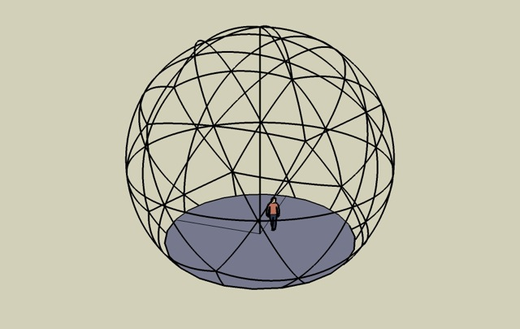
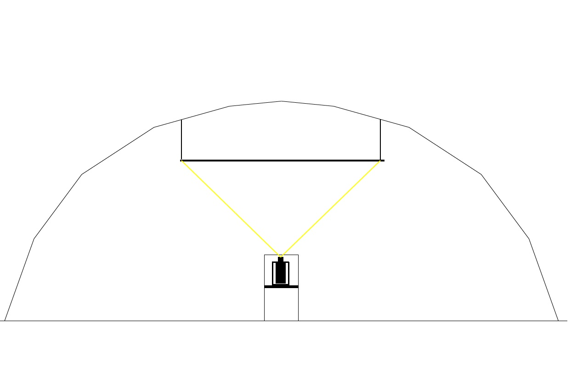
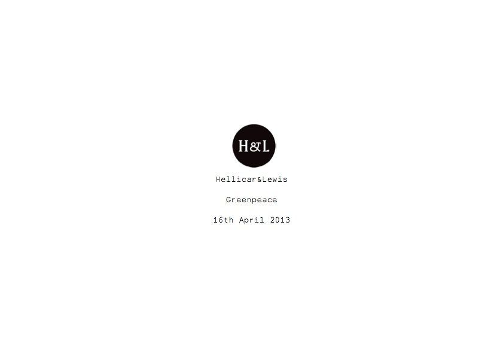
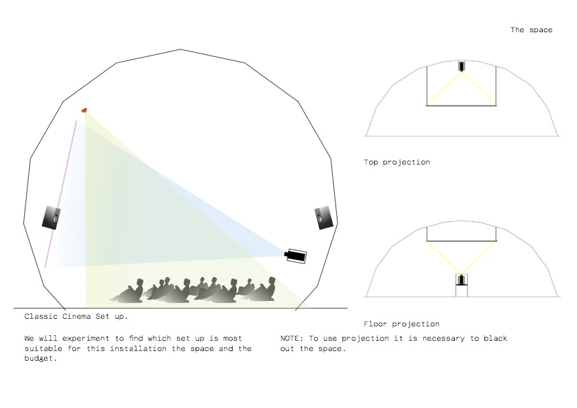
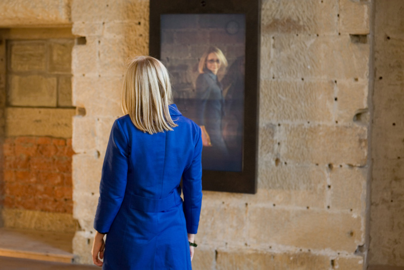

#Anthropocene

*by [Joel Gethin Lewis](http://www.hellicarandlewis.com/)*

This chapter presents an overview of an Anthropocene, an body reactive interactive video installation for Greenpeace as part of their field at Glastonbury 2013.   It's presented here in the form of diary / journal, discussing the work in narrative form from initial emails, concepting and back and forth through to final coded work.  

To see the finished project as part of a wider event please see the 

Or an 

All source code can be found 

**Anthropocene**

_Adjective_

_Relating to or denoting the current geological age, viewed as the period during which human activity has been been the dominant influence on climate and the environment._

## The Project

### Initial Brief from Client

On 9th April 2013 we were approached by Paul Earnshaw of Greenpeace about an installation as part of Greenpeace's Field at Glastonbury 2013, a large music festival in the South West of England. Another interaction design studio had previously been in place to create a five day experience due to go live for the public duration of the festival on the 25th of June, but a scheduling conflict had emerged that had meant that they had to reluctantly withdraw.

Paul already had a budget and a unique space picked out for the installation, a large geodesic dome:



### Our response

We initially sought out a projector hire firm, who responded with a quote and a plan for a projection setup that met our requirements for maximum visual impact on a budget:



After some studio thinking, by 16th April we responded with the following document:



>We would like this installation to be a relaxing and immersive space. An oasis where the viewer can relax on bean bags looking up at a screen.
>
>We will use a mix of existing Greenpeace footage and a generative sound-scape to build a beautiful abstraction of the Arctic.
>
>We would like to project onto the ceiling of the space, using either a rectangular, square or circular projection surface. We will experiment with different projection >shapes and see what fits best aesthetically as well as meeting the budget.
>
>We would like to explore the following ideas within the imagery, sound and feeling of the space.
>
>1: The space as a timepiece - trying to have a cycle of sunset, night and dawn - each lasting around five minutes and having a single interaction between the floor and >ceiling that is explored graphically and interactively.
>
>2: Kaleidoscopes, shattering or delaying or time stretching footage. Breaking it up into blocks of time. Arranging in grids, or having different delays in different parts. >The possibility of peoples movement being mirrored into the video playback in interesting ways, playing with time.
>
>3: Making an oasis away from the rest of the festival that would last around 15 minutes, but raise some points about how the cycle of seasons of the Arctic are being >affected.
>
>4: Generative audio - a four channel speaker system that adds depth and texture the visuals.




On April 30th, we received an email from Paul:

"..we would love you to implement your proposal in our main feature of the dome at Glastonbury Festival this year..."

We had the project! Now it was time to get real about the budget, and see if we could get some interesting musical collaborators...

During May, we concentrated on discovering what film footage was available, and finalising the production design and kit list. My business partner Pete Hellicar spent many hours working on the edit of the film, aiming to complete it while other negotiations continued.

### Audio negotiations

On May 10th, Pete reached out to our friends at Warp Records to see if any of their artists would be interested in donating their music to the project, and by the nick of project time we had permission from several artists to use their sounds.

### Supplier change, Final Budget Negotiations and Interaction Plan

By the end of May, we had changed hardware suppliers to ones already working with Greenpeace on their field, and had found replacement kit for our production. After experimenting with a circular projection screen, we'd arrived at a traditional projector set-up within the dome - a large rectangular projection screen about halfway up the dome wall with seating arranged in front of it. We'd also reached a final budget, and I was ready to start coding.

Pete and I had arrived at a final interactive concept after some discussions with Paul, who stated that a "show time" of about 15 minutes was desirable - enough time to get a detailed message across, but not so long as to bore a casual visitor. Pete took his film edit to 15 minutes and had it approved by the Greenpeace team for pacing and content. We decided to use the Microsoft Kinect to allow the openFrameworks application to distort or effect the film footage in real time - based on viewers movements in front of the projection screen. To make the dome a bit more comfortable Paul arranged the donation of several jumbo size bean bags - meaning that visitors could lie comfortably and wave their hands in the air to interact with the film - we angled the Kinect to hopefully pick up unintended user interaction first, surprising users and gently guiding them to stand in front of the bean bags and use their whole bodies to interact. We knew we had to strike a balance between a pre-scripted show and a completely spontaneous one - so we decided on developing several visual looks which could be placed onto a time line for easy repetition, editing and playback. The aim was to get to a system with the reliability of a static linear film and the responsivity of a live "VJ" system - albeit one that used the viewers silhouette rather than pre-rendered matts to affect the edited Greenpeace film.

At the beginning of June 2014 we received the following image from Paul:


The site awaited us.

### Interactive Background to Delay Maps, and the possibility of generating a Delay Map from the Kinect Depth Image


We are the time. We are the famous. Created at Fabrica.



Hereafter by United Visual Artists.


Feedback by Hellicar&Lewis.

Pete started the project by doing some sketches in Photoshop of how two dimensional angular shapes could "shatter" video footage - I realised that we could make similar effects in real time by using a delay map. This brought me back to previous projects around varying video delay across a whole image - starting with ["We are the time. We are the famous"](http://www.benettongroup.com/40years-press/fabrica_yeux_ouverts.html) at [Fabrica](http://fabrica.it/), continuing with [Hereafter](http://uva.co.uk/work/hereafter) at [UnitedVisualArtists](http://uva.co.uk/) and finally [Feedback](http://www.hellicarandlewis.com/the-roundhouse/) at [Hellicar&Lewis](http://hellicarandlewis.com). Many people have been interested in this area for some time, [Golan Levin](http://www.flong.com/) has compiled a [list of related works](http://www.flong.com/texts/lists/slit_scan/).

A delay map is simply grey-scale image that is used in combination with a digital video file to decide how much the video file should be delayed on a per-pixel basis. In this projects case a white pixel in a certain position in the delay map meant that there would be zero delay on the corresponding pixel of the video file currently being played back. Conversely, a black pixel in the delay map image would mean the maximum frame delay on the corresponding pixel of the video file. I.e. a completely white delay map image would combine with a video file to play back with zero delay, whilst a black image would give a uniform maximum delay - a linear horizontal grey-scale gradient would give a gradated delay from 0 on the white side to maximum on the black side - with all divisions smoothly displayed in between.

Delay maps are a great way of allowing an art director to quickly "paint" several grey-scale images in Photoshop or some similar image editing program and see the effects of that map on any video file - abstracting away the technical details of the underlying video delay code. This approach of using imagery to control underlying code is a particularly effective technique - making new tools for Art Directors to interface with code using visual techniques rather than syntax and text heavy traditional software engineering techniques.

The breakthrough after this initial thinking was to try to think of what other grey-scale maps I had seen - the live depth image of the Kinect! This would allow peoples 3D silhouettes to create per pixel delay maps that would change in real-time as they moved in front of the 3D sensors of the Microsoft device. The addition of James Georges [ofxSlitScan](https://github.com/obviousjim/ofxSlitScan) made swapping in and out static grey scale maps very simple, all I had to do was combine the depth map with his existing code on a frame by frame basis.

### Actual Timeline

Here are the folder names of all the folders in my GreenpeaceArcticGlastonbury2013 folder.

* 2013_04_11_PlansAndContentFromGreenpeace
* 2013_04_16_ProjectorQuotes
* 2013_04_30_PeteQuoteAndIdeas
* 2013_05_08_GlastoOverviewPlan
* 2013_05_14_PetePlanAndTechList
* 2013_05_20_GuestList
* 2013_05_28_CrewDetailsFromPete
* 2013_05_29_addons
* 2013_05_29_addonsAfterPragmatism
* 2013_05_29_ofxGUIFromDevelopGitHubBranch
* 2013_05_31_AddMaps
* 2013_06_02_BaficInvoice
* 2013_06_03_PeteEffectsFromSomantics
* 2013_06_04_HomeHigherResForPete
* 2013_06_06_CallToActionScript
* 2013_06_12_CrewForFieldReadup
* 2013_06_12_Font
* 2013_06_12_GreenpeaceLogos
* 2013_06_12_MoreCrewBriefing
* 2013_06_13_HuntResult
* 2013_06_13_MoreDurationBits
* 2013_06_13_obviousJimAudioReactiveRing
* 2013_06_16_ofxTimelineVideo
* 2013_06_19_Singleton
* 2013_06_19_VoiceOverOutro
* 2013_06_20_CateringMenu
* 2013_06_20_NewAddonsToTry
* 2013_06_24_CodeForArtFromJeffTimesten
* 2013_06_24_DeadFlock
* 2013_06_24_newFilmAndAudio
* 2013_06_24_ofxAddonsOFXContourUtil
* 2013_07_31_Final50Invoice
* 2013_08_18_ThankYouFromGreenpeace

## Development
### Development Hardware and Software setup

MacBook Pro
* 15-inch, Mid 2009
* Processor: 3.06 GHz Intel Core 2 Duo
* Memory: 4 GB 1067 MHz DDR3
* Graphics: NVIDIA GeForce 9600M GT 512 MB

* XCode for Development
* Chrome for Web Browsing
* Sublime Text for logging

### Explanation and Discussion of Development in Detail

#### ofxKinect, as a possible input to ofxSlitScan

One of the benefits of using a platform like openFrameworks is that when people do release extras or "addons" they inevitably interface with the core - interesting results can be found by thinking about how addons can interface with each other using the core as a bridge.

In ofxKinect and ofxSlitScan's case, both addons used the same type of data:

```cpp
unsigned char* getDepthPixels();       ///< grayscale values //from ofxKinect.h
```
and
```cpp
void setDelayMap(unsigned char* map, ofImageType type); //from ofxSlitScan.h
```
So connecting them was simple:
```cpp
slitScan.setDelayMap(depthPixels); //from testApp::update() in testApp.cpp
```
This kind of separation demonstrates encapsulation or the information hiding qualities of software - the utility of not having to know the specifics of the implementation of the functionality described, merely the inputs required and outputs produced.

http://en.wikipedia.org/wiki/Encapsulation_(object-oriented_programming)
http://en.wikipedia.org/wiki/Information_hiding

#### ofxSlitScan, using PNG's and moving to generating realtime delay maps, making a Aurora

Starting is often the hardest thing to do with programming. To combat this, I try to do the stupidest, most obvious thing first and then build from there. In this project, I started by prototyping various looks using static PNGs - feeding new data into the examples provided with ofxSlitScan. The provided an easy sketching ability - combined with a paint program to quickly produce many input variations.

The next place to experiment was making the input real-time and interactive - using the blobs from a sliced section of the live Kinect depth image from ofxKinect. Drawing these simple blobs as an image allowed them to be inputted into ofxSlitscan on a frame by frame basis - producing a time warping effect over the playback of the film that Pete Hellicar edited for the project. As so often happens, when the input to the interaction becomes real-time it was far more engaging, which is exactly what we wanted users to do - see SLITSCANKINECTDEPTHGREY mode below for more details on the precise implementation, and in the other cases that follow.

What else could be done with the depth information applied to the delay map of the slit scan? Experiments with effecting the blobs outline yielded the SPIKYBLOBSLITSCAN mode. Using the input from the Kinect as an input to a paint simulator was something that I had worked on with Marek Bereza in the Somantics project - it made sense to try it as an input to a slitscan, as can be seen in the PAINT mode. This Paint mode made something that very much resembled the appearance of a human aurora when mixed with the beautiful Borealis footage that Pete Hellicar had sourced with the help of Greenpeace. SPARKLE mode was another example of a successful port from Somantics to Anthropocene.

Another good strategy for finding new interesting things is to feed the output of a system back into its input - this is demonstrated well by the visual feedback effects produced by using video frames as the delay maps back into their own history - implemented in SELFSLITSCAN mode.

#### ofxBox2d, making ice, previous projects with Todd Vanderlin

I had previously worked with Todd Vanderlin on the Feedback project, where we had experimented with using Box2D (via Todd's ofxBox2D) as a way of "shattering" live video. Feedback used a screen orientated in portrait mode that encouraged the repeating of familiar existing behaviour - moving the experience from a tech demo to a playful joyous one. Having earlier experimented with ice like static PNG's I knew that using real-time triangles from ofxBox2D would work well - this time I had the advantage via the Kinect of a slice of 3D space as input, something that Todd had to work much harder to simulate using only 2D live camera input in Feedback. This aspect of constantly improving novel hardware inputs means that previous work can often be revisited and explored.

#### ofxTimeline, understanding how cuing works

To combine the film and the various real-time effects, it was essential to develop a cuing system to allow different effects to combine with different scenes in a reliably repeatable way. I began by experimenting with Duration, but after emailing the author of the addon (see development notes above), it become apparent that ofxTimeline would be a much better fit for the project - a subset of Durations code base.

After dealing with Quicktime performance issues (see below), the main challenge was cuing the effects. The structure of how ofxTimeline passes messages meant that the signal to switch scenes would only be sent when the play-head passed over the cue - clicking to a point after a cue meant that the signal to switch scenes would not be despatched. Deadlines of other functionality meant that this couldn't be fixed in time for show time - meaning that show operators would have to be careful when shuffling playback during the show proper.

#### ofxGui, running the Latest branch from Github, multiple input methods and GUI addons

I knew that I wanted to augment ofxTimelines interface with controls for the setup of the Kinect and other custom requirements for the project. Watching the GitHub development branch revealed the release of an official core GUI addon - something I wanted to experiment with, which meant that I had to switch from an official static release of OF to the live development branch via Github. The project ended up with multiple interfaces - two graphical ones (ofxTimeline and ofxKinect control mainly) and a keyboard based one (consisting mainly of single boolean switches together with playback and editing shortcuts). With further development, a unified GUI would be desirable, but development pressures meant it wasn't a priority.

#### ofxOpticalFlowFarneback, making a polar bear

During development and testing, I realised a furry look could serve well for making people feel like they were polar bears. I had seen "spikey" outline looks before - all achieved by drawing normals along the circumference of a blob. I'd also experimented with optical flow in previous projects and started thinking about how the two could be combined - I looked for optical flow addons on [ofxaddons.com](http://ofxaddons.com) and discovered a flurry of recent activity since I'd last checked. Development tends to flow like this - periods of fallow followed by simultaneous parallel development from several quarters.

* [ofxCvOpticalFlowLK by James George](https://github.com/Flightphase/ofxCvOpticalFlowLK) 
* [ofxOpticalFlowFarneback by Tim Scaffidi](https://github.com/timscaffidi/ofxOpticalFlowFarneback)
* [ofxOpticalFlowLK by Lukasz Karluk](https://github.com/julapy/ofxOpticalFlowLK)

Tim Scaffidi's version immediately stood out to Pete, so I developed two simple colourings for Aurora and Polar Bear modes, merely tweaking Tim's excellent demo code.

### XML Issues around the Naming of Scenes

Mid development, I found that saving the XML wasn't functioning as expected - it turned out to be the fault of non alpha numeric characters in scene names. I learnt the hard way that it's always good to avoid punctuation and spaces altogether and use [CamelCase](http://en.wikipedia.org/wiki/CamelCase).

### Video Performance, using the HighPerformanceExample

Right from the beginning of the project, it was obvious that video decoding would be significant portion of processing time per frame. Others in the openFrameworks community had been investigating performance in recent years, with James George contributing an [OSX only High Performance video example](https://github.com/openframeworks/openFrameworks/commit/4e02db8d82c520bef6c09d58b37076a84fe37571). This used native Quicktime playback features, enabling far higher performance on compatible hardware. While this undoubted enabled the film playback to function smoothly, it did make the code less platform independent - one of the inevitable compromises that happens during development.

### Counting the items in an Enum

I knew that I would have to switch between different visual looks as the film was played back by the program. C++ provides the ENUM keyword to allow the coder to define a data set of named elements, but I needed a way to count the number of modes programmatically. [Stack Overflow](http://stackoverflow.com/questions/2102582/how-can-i-count-the-items-in-an-enum) provided the solution.

```cpp
enum GreenpeaceModes {BLANK, GUI, VIDEO, VIDEOCIRCLES, KINECTPOINTCLOUD, SLITSCANBASIC, SLITSCANKINECTDEPTHGREY, SPARKLE, VERTICALMIRROR, HORIZONTALMIRROR, KALEIDOSCOPE, COLOURFUR, DEPTH, SHATTER, SELFSLITSCAN, SPIKYBLOBSLITSCAN, MIRRORKALEIDOSCOPE, PARTICLES, WHITEFUR, PAINT, GreenpeaceModes_MAX = PAINT}; //best to use ALL CAPS for enumerated types and constants so you can tell them from ClassNames and variableNames. Use camelCase for variableNames - http://en.wikipedia.org/wiki/CamelCase
 
/* http://stackoverflow.com/questions/2102582/how-can-i-count-the-items-in-an-enum
 For C++, there are various type-safe enum techniques available, and some of those (such as the proposed-but-never-submitted Boost.Enum) include support for getting the size of a enum.
 
 The simplest approach, which works in C as well as C++, is to adopt a convention of declaring a ...MAX value for each of your enum types:
 
 enum Folders { FA, FB, FC, Folders_MAX = FC };
 ContainerClass *m_containers[Folders_MAX + 1];
 ....
 m_containers[FA] = ...; // etc.
 Edit: Regarding { FA, FB, FC, Folders_MAX = FC} versus {FA, FB, FC, Folders_MAX]: I prefer setting the ...MAX value to the last legal value of the enum for a few reasons:
 
 The constant's name is technically more accurate (since Folders_MAX gives the maximum possible enum value).
 Personally, I feel like Folders_MAX = FC stands out from other entries out a bit more (making it a bit harder to accidentally add enum values without updating the max value, a problem Martin York referenced).
 GCC includes helpful warnings like "enumeration value not included in switch" for code such as the following. Letting Folders_MAX == FC + 1 breaks those warnings, since you end up with a bunch of ...MAX enumeration values that should never be included in switch.
 switch (folder)
 {
 case FA: ...;
 case FB: ...;
 // Oops, forgot FC!
 }
*/
```
I used the Stack Overflow tip in the `void testApp::keyPressed (int key)` method.

```cpp
case 'a': //used to be key left, but it interferes with ofxtimeline
{
    currentMode = (GreenpeaceModes)((int)currentMode - 1);
    if(currentMode < 0){
        currentMode = GreenpeaceModes_MAX;//see .h file for stackoverflow justification
    }
    break;
}
case 's': //used to be key right, but it interferes with ofxtimeline
{
    currentMode = (GreenpeaceModes)((int)currentMode + 1);
    if(currentMode > GreenpeaceModes_MAX){
        currentMode = (GreenpeaceModes)0;//see .h file for stackoverflow justification
    }
}
```

While I could have gone down the [polymorphic](http://en.wikipedia.org/wiki/Polymorphism_(computer_science)) custom class route, I felt that the ENUM apporach provided good performance (through compiler optimisation of common C++ coding paradigms), speed of development (lower file overhead) and clarity of code.

### Sequencing


Kieran and Pete completed the main sequencing on-site.

## Show time


## Post Event

The biggest PR boost to the project while it was live was a [review](http://www.glastonburyfestivals.co.uk/news/greenpeace-at-glastonbury-2013) from Timeout:

"A highlight of the Greenpeace field was undoubtedly the Arctic Dome, voted by Time Out as the second best non-musical thing to do at the Festival and previewed by NME. It offered people the opportunity to disappear through a crack in the ice and take a magical 15-minute trip to the North Pole, where ice towered and the Northern Lights danced."

### Testimony from Show Operators

Kieran and Bafic were the people who ran the show for the general public, below is their testimony, with Kieran starting:

*Did you have a routine before show time?*

Before the first show of the day we’d double check the connection between the laptop and the Kinect and test with the skeleton tracking that everything was working correctly. Before show time we’d dim the lights, make sure the sound was turned on, switch to the point cloud setting so people could see themselves as they walked in and then we’d turn the beanbags upright so as to ’set the scene’. Then, as people started to walk in we’d raise the lights as though they were walking on stage. And then before we pressed play we’d dim the lights to black.

*Any problems during shows? Crashes? Funny stories?*

A couple of times the connection between the Kinect and the laptop failed due to the cable being under tension so we just had to let the show run to the end before we could fix it. The main problem we had was the projector overheating and displaying a lamp warning which involved having to find the technician to sort it. At one point the projector overheated so badly that we had to leave it switched off for 40 minutes before we could run the show again.

Off the top of my head I can’t think of anything I’d like to change about it, the GUI had quite a steep learning curve so it took a while to remember all the keys to press to hide each part of the interface but once we’d mastered that everything was fine. I guess the only thing that would be good but most likely ultimately un-achieveable would be full automation in the sense that the station wouldn’t have to be manned at all times.

Following is Bafic's post show report:

*Did you have a routine before show time?*

Before every show we would go through different ways to layout the bean bags. It's started off as just a small idea but as we kept on doing it we noticed that it would affect how people acted with the film. Some were semi circles some were bean bags set up in rows like cinema seats sometimes we pushed all bean bags to the back and told people they had to stand up and use their full body to  interact with the film.

When seated in rows people mostly used their arms (a few people were moving the legs in air sitting down) but never was it a full body movement until we moved bean bags to the back . Some excited people would stand up and run to in front of the Kinect and interact with it that way, after they had finished they would sit down and someone else would follow due to the sheer curiosity of seeing what the previous person had done. It was interesting because everyone was so curious as to what would happen. I was sitting their amazed because their were a few loops/back and forths happening.

1. You had the back and forth between the one person who would stand up interact with the Kinect and then that would show up on the projection.
2. They would sit down and the next back and forth would be the next person to stand up start off with maybe replicating the previous persons techniques and movement AND Then coming up with the own ideas and movement.
3. then their was us who was watching and getting excited and seeing what they were doing and changing effects depending on what the user was doing and what we felt like could be interesting then obviously what we put on screen would effect how the person would dance/move/use their body. The whole thing was like a 3x over Möbius strip of events and occurrences that kept affecting the previous element and also the next element at the same time!

*Any problems during shows? Crashes? Funny stories?*

I can't think of any crashes or problems that happened. Their was a time when someone came in with a puppet on a long stick and they waved it at the Kinect and that would egg on the rest of the audience because this funny puppet would appear on screen. The whole experience was really amazing and interesting.

### Open Source discussions with Client

Greenpeace were happy for us to Open Source, as we do with all our projects. Greenpeace does not have a GitHub of it's own, but we were able to suggest that that should be part of their future strategy. The problem was the film that formed the backdrop for the interaction - while musicians were happy to license music for a live only experience, getting those rights in perpetuity has been challenging. Negotiations continue.

### Re-running remotely in Australia and New Zealand

The project has been re-exhibited twice in the Southern Hemisphere - in Australia and New Zealand. Getting the code up and running wasn't a problem - but training someone to use the two layers of mouse GUI and on layer of Keyboard GUI was  a challenge, especially over a painfully slow Skype connection.

### Future development

Paul Valery said 'Poems are never finished - just abandoned'. This is sadly true for all artistic endeavours. Below are three areas for future development.

#### Social interaction

The [Hello Wall](http://www.hellicarandlewis.com/the-hello-wall/) and [Hello Cube](http://www.hellicarandlewis.com/tate-modern/) projects showed how making feedback loops between users and installations via social networks is not only fun, but helps spread awareness of the installation beyond the physical bounds of the project. Imagine allowing users to post comments to the projection as it happening via Twitter and receiving bespoke screen grabs showing evidence of their interaction in return - or even choosing which of the interactive effects is active at a certain time. The meta data of these interactions could be used to come up with the most enaging timeline, or to deliver messages to users in the days, weeks and months following the installation - particularly useful for an organisation such as Greenpeace that relies on public support to lobby Governments and Corporations.

#### Broadcast

Pete and I discussed how we could transform the installation into one that broadcast itself to a wider audience when we were in the planning stage. Unfortunately, securing a reliable Internet connection at the Glastonbury Music festival proved impossible. Post and Previous Hellicar&Lewis projects for [Nike](http://www.hellicarandlewis.com/nikefeeltv/) and [Coca-Cola](http://www.hellicarandlewis.com/coke/) show how broadcasting an installation with the addition of social network interaction can dramatically increase engagement. We hope to be able to make such a socially activated broadcast interaction with Greenpeace in the near future - imagine several locations around the world witnessing the same film simultaneously with body movement from each location feeding back into the others - live video portals of depth maps crossing continents and time zones to produce a truly global event.

#### Raspberry Pi

With the advent of a [Raspberry Pi](http://www.openframeworks.cc/setup/raspberrypi/) port of openFrameworks, a port of the project to the platform would allow for the deployment of the project to events that have even smaller budgets than this iteration. This would also entail a port of the Kinect code to 2D computer vision, but I'm confident this would be a spur for other interactions and visual effects.

###Conclusion

All in all, for a low budget project, using openFrameworks was the differentiator that enabled me to collaborate with the rest of the team at Hellicar&Lewis to make the installation come to life. The key factors were being able to draw upon so many external addons, previous projects and the community as a whole.

## Team and Credits

* Pete Hellicar and Joel Gethin Lewis
* Commissioned by Paul Earnshaw of Greenpeace
* Produced by Sarah Toplis
* Assisted by [Bafic](http://www.bafic.co.uk/) and [Kieran Startup](http://www.kieranstartup.co.uk/)

Project uses addons and other code Contributions from:

* [Marek Bereza aka Mazbox](http://www.mazbox.com/) as part of Cariad Interactive
* [ofxKinect](https://github.com/ofTheo/ofxKinect) by [Theo Watson](http://www.theowatson.com/)
* [ofxSlitScan](https://github.com/obviousjim/ofxSlitScan) by [James George](http://jamesgeorge.org/)
* [ofxBox2d](https://github.com/vanderlin/ofxBox2d) by [Todd Vanderlin](http://vanderlin.cc/)
* [ofxTimeline](https://github.com/YCAMInterlab/ofxTimeline) by [James George](http://jamesgeorge.org/)
* [ofxOpticalFlowFarneback](https://github.com/timscaffidi/ofxOpticalFlowFarneback) by [Tim Scaffidi](http://timothyscaffidi.com/)

Thanks to:
* All our families and friends.
* The Greenpeace Family
* Microsoft for being Open
* [Theo Watson](http://www.theowatson.com/)
* The entire openFrameworks community
* [Marshmallow Laser Feast](http://marshmallowlaserfeast.com/)
* [Tim Scaffidi](http://timothyscaffidi.com/)
* [James George](http://jamesgeorge.org/)
* [YCAM InterLab](http://interlab.ycam.jp/en)

## Hardware selection

* 1 x 3D Camera - Microsoft XBox360 Kinect
* 1 x Playback and Interaction Computer - MacBook Pro Retina
* 1 x 10K projector
* 1 x Projection Screen
* Sound - 4 x D&B T-10 Top + Amp 2 x Subs
