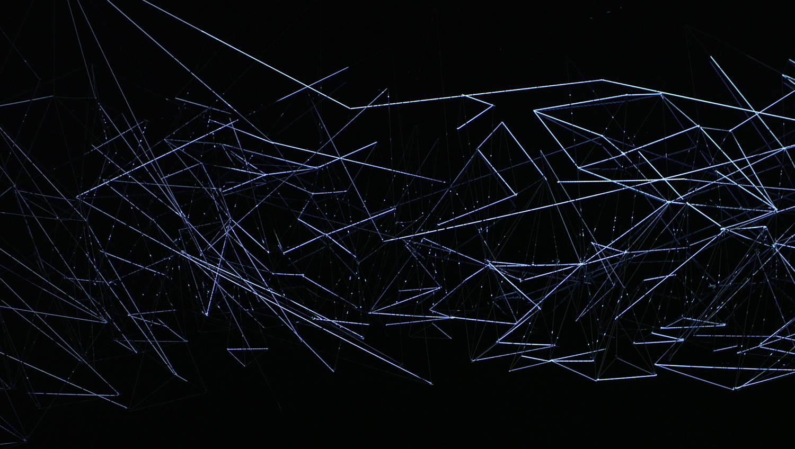

#Case Study : Line Segments Space

==please format this==

* Kimchi and Chips
* Mimi Son, Elliot Woods
* Installation
* Seoul, 2013
* 4x3x7 meters (WxHxD)
* Digital Emulsion, Nylon String

##Foreward
Line Segments Space is an artwork created by studio Kimchi and Chips (Mimi Son, Elliot Woods), and is the third installation within a series of works titled 'Digital Emulsion', preceded by Lit Tree (2011) and Assembly (2012). The pricipal technician for this project is Elliot, me, the voice of this chapter.

This chapter will discuss some of the technical details of the project to varying levels of detail. Before continuing, I hope that you will first take a little time to view the work in a non-technical context and watch the video, for example by visiting the work on our website at [http://kimchiandchips.com/#LSS](http://kimchiandchips.com/#LSS).

The work contains a number of technical solutions, the principal one being an implementation of the Digital Emulsion technique. Others include a custom CAD application, generative 'brushes' for volumetric content, optical design of the room and equipment, sound control and spatialisation and calibration by a team of client computers . This chapter on a couple of these challenges.

==perhaps this should be a list of what is actually in the chapter==

##Artist statement

An architectural web of threads spans a gallery space. It hangs abstract and undefined, a set of thin positive elements segmenting the dark negative space between. Dynamic imaginary forms are articulated into physical volume by the material of this thread, and the semi-material of the light. The visual gravity of the filaments occupying the space between.

A 2D canvas is reduced from a surface piece into a line segment, but then constructed into another dimension, a volume. Light creates contrast and order on the lines to articulate digital matter. Digital forms inhabit the interconnected boundaries of space, moulding visual mass,

The artists reference Picasso’s light painting, and Reticuláreas of Gego who’s work offers a contemplation of the material and immaterial, time and space, origin and encounter and art and technology.

Kimchi and Chips create technology which paints into different dimensions, bringing new canvases and expanding the possibilities for artists to articulate form. These technologies become a corpus of code, offered without restriction on the internet. Their code  is adopted by other artists and corporations, spreading values and ideas implicit with the artists’ work into shared cultural idea space. Line Segments Space lives both as a dynamic gallery object, and as an encapsulation of the techniques as new computer code and tools on the internet.

##Digital Emulsion

Line Segments Space employs Digital Emulsion to accurately aim light from the projectors onto the individual threads, whilst also to determining the 3D geometry of the web. Digital Emulsion (otherwise referred to as Re-projection Scanning) is a technique which combines 3D scanning with projection mapping in order to create new canvases for visual expression.

The technique combines the use of a video projector and an imaging camera (e.g. DSLR or machine vision camera) to augment a physical object. The steps for this are generally:

1. Calibrate the camera and projector (e.g. using OpenCV)
2. Perform a Structured Light scan of a scene (e.g. using ofxGraycode)
3. Triangulate the 3D location of every projector pixel in the scene (e.g. using ofxTriangulate)
4. Render a graphical response to the scene using the triangulation data
5. Project this response back onto the scene using the structured light data to perform a pixel-precise mapping between the projector and the scene.

###Structured light
Structured Light refers to a set of techniques which couple projectors with sensors to take readings of the physical world.

A very simple structured light technique is to project a thin white line onto a scene and to take a photo of it. Within the photo, we can see that the line kinks and bends within the cameras image as it passes over 3D features. Using some trigonometry we could perhaps calculate something about the 3D shape of the object based on the displacement of this line.

(insert photo of line projected onto object e.g. http://www.david-3d.com/gfx/slides/4.jpg)

If we took many images (e.g. a video) whilst moving the line across the whole scene, then we could recover a lot of 3D information about the scene, and make a mesh (e.g. ofMesh).

Generally for Digital Emulsion, we use a structured light technique called Graycode Structured Light. If you're interested in learning more, I suggest checking out either [ofxGraycode](http://github.com/elliotwoods/ofxGraycode) or [David laser scanner](http://www.david-3d.com/) (a free to download standalone scanning app which employs structured light).

The specific advantage of using Graycode (rather than 3-phase) structured light for Digital Emulsion projects, is that it gives you accurate information of the location of the __projector's pixels__ rather than of the __camera's pixels__. Folowing the Graycode scan, we can now consider that our projector's pixels are sensing the scene but are still also useable as pixels, that they in fact sensor-pixels, which we will shorten to sexels.

##Technical solution 

###Constraints

The first presentation of Line Segments Space was at Seoul Art Space Gumcheon between September and October 2013, the exhibition had the following constraints:

* 1 week installation time
* 4 week run time
* Temporary room built by gallery
* No other external production assistance (e.g. tech team)
* Limited production budget from gallery, other costs to be covered by ourselves

###System overview

==insert system diagram==
